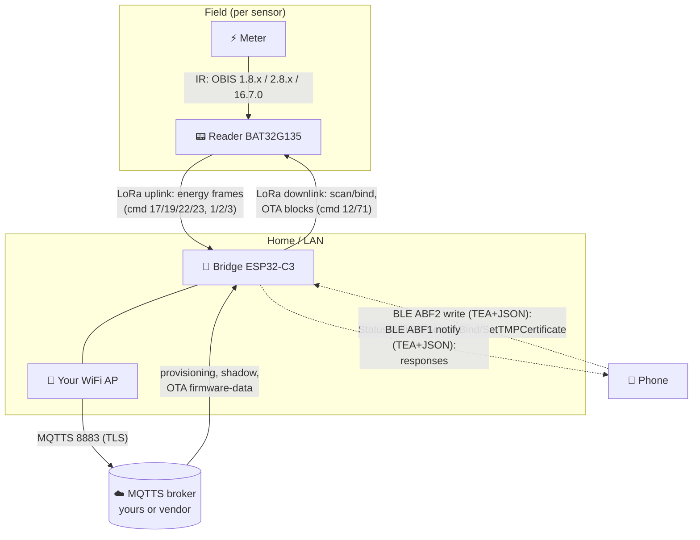
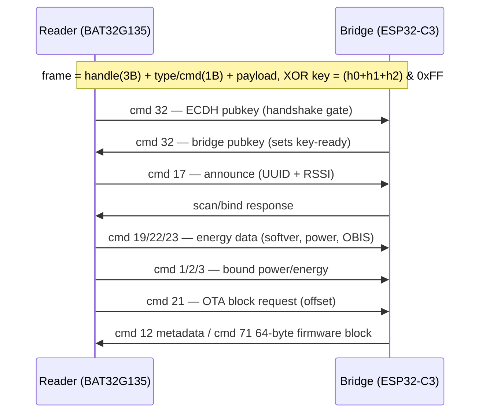
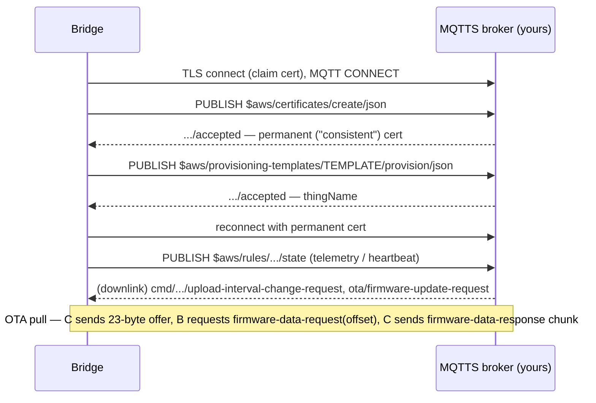
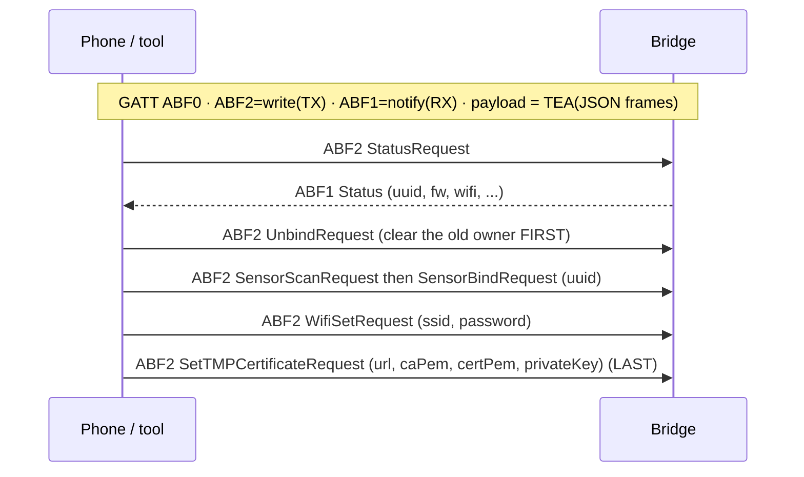

# 01 · Architecture & Data Flow

How the pieces connect and **what travels in each direction**. Three links: meter↔reader (IR),
reader↔bridge (LoRa 868 MHz), bridge↔cloud (MQTTS), plus phone↔bridge (BLE) for setup.

## Components

| Node | Chip | Role |
|---|---|---|
| **Meter** | — | Electricity meter with optical/IR port (DLMS/OBIS) |
| **Reader** | BAT32G135 (ARM Cortex-M0+) + SX1262 | Reads the meter, sends energy over LoRa |
| **Bridge** | ESP32-C3 (RISC-V) + SX1262 (Ra-03SCH) | LoRa ↔ WiFi/BLE ↔ cloud gateway |
| **Cloud** | AWS IoT (vendor) **or your MQTTS broker** | Provisioning + telemetry + OTA |
| **Phone** | heyOBI app | BLE setup: WiFi, certs, sensor bind |

> **Firmware 1.2.x** widened this: a bridge now handles **several sensors at once** and adds **smart
> outlets** (relay + power metering). Telemetry moved to `schema_version: 2` (`paired_devices[]` with a
> `device` type, `upload_interval`, `outlet/…` topics), and downlink commands became **per-device**
> (they carry the target `uuid`). See [cloud-api.md](../03-reverse-engineering/cloud-api.md#downlink-commands-cloud--device).
> The links below are unchanged across versions.

## End-to-end data flow

## Who sends what (directions)

### LoRa (reader ↔ bridge, 868 MHz)

Details & payload byte layouts: [../03-reverse-engineering/lora-protocol.md](../03-reverse-engineering/lora-protocol.md).

### Cloud (bridge ↔ MQTTS)

Topics and the self-host setup: [../04-connect-your-own-cloud/README.md](../04-connect-your-own-cloud/README.md).

### BLE (phone ↔ bridge, setup)

Codec + command list: [../03-reverse-engineering/ble-protocol.md](../03-reverse-engineering/ble-protocol.md).

## Transports & the internal "vsocket"
Inside the bridge, one framing layer (**vsocket**) is multiplexed by a *pipe id* and dispatched by a
*protocol* number:

| pipe (transport) | protocol space | reached over |
|---|---|---|
| 1 | BLE JSON (TEA) | BLE ABF2 |
| 0 | proto 2 — management / OTA-from-cloud | MQTT / BLE pipe 0 |
| 2 | proto 254 — plaintext config | **UART0 console** |
| (LoRa) | proto 0 — reader commands | 868 MHz radio |

This is why the same OTA and command handlers appear on multiple links. Reference:
[../03-reverse-engineering/firmware-layout.md](../03-reverse-engineering/firmware-layout.md).
