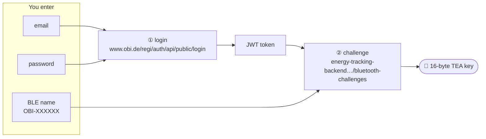
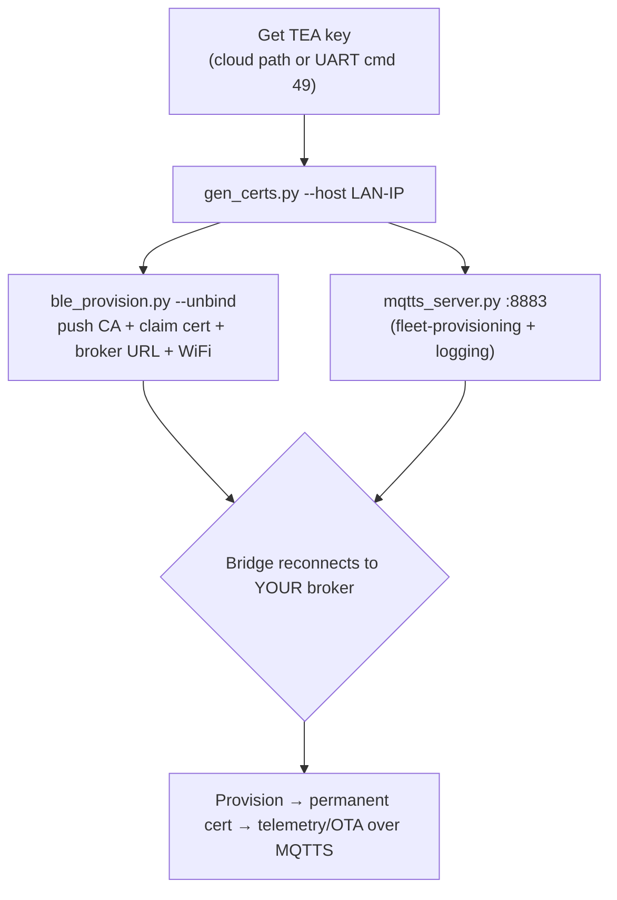

# 04 · Connect your own cloud

Make the bridge talk to **your** MQTTS broker instead of the vendor cloud — so your energy data stays
local and you own the device. The device authenticates the server via a CA you hand it over BLE, then
runs AWS-IoT-style fleet provisioning against your broker.

> Everything here is for a device **you own**. All keys/certs are placeholders; you generate your own.

## Step 0 — get the device's TEA key

Everything else needs the bridge's **16-byte TEA key** (it encrypts the BLE control channel; one key per
device). There are two ways to get it — the cloud way is the easiest and needs no access to the hardware.

### Way 1 — from the cloud (easiest — just needs an OBI login + the BLE name)

You only need **three things**: an OBI account email, its password, and the device's **BLE name** — the
`OBI-XXXXXX` it advertises (read it with any BLE scanner — it is *not* printed on the device). That name *is* the challenge id.
The device does **not** have to be registered to your account — any valid OBI login works and the endpoint
returns the key for whatever `OBI-XXXXXX` you ask for (see [security notes](../03-reverse-engineering/security-notes.md)).



**Simplest — run the script and answer three prompts:**
```bash
python tools/fetch_tea_key.py
#   OBI account email:            you@example.com
#   OBI account password:         ********
#   Device BLE name (OBI-XXXXXX): OBI-XXXXXX
#   → TEA key for OBI-XXXXXX: 00112233445566778899AABBCCDDEEFF
```

**Or by hand (curl):**
```bash
# ① log in → token
TOKEN=$(curl -s https://www.obi.de/regi/auth/api/public/login \
  -H 'content-type: application/json' -H 'x-app-type: b2c' \
  -d '{"email":"you@example.com","password":"YOUR_PASSWORD","country":"DE"}' | jq -r .token)

# ② ask the cloud for this device's key (any valid login + the BLE name; no account-ownership check)
curl -s https://energy-tracking-backend.prod-eks.dbs.obi.solutions/bluetooth-challenges \
  -H "authorization: Bearer $TOKEN" \
  -H 'accept: application/vnd.obi.companion.energy-tracking.bluetooth-challenge.v1+json' \
  -H 'content-type: application/json' \
  -d '{"btChallengeId":"OBI-XXXXXX"}'
# → {"key":"<32 hex = your 16-byte TEA key>"}
```
Note: the endpoint does **not** check device ownership — a valid login plus the `OBI-XXXXXX` name is enough
to get that device's key. Use it for your own device. (Physically, the UART path below needs no cloud at all.)

### Way 2 — from UART (physical access to the gateway)
No account needed: send `C5 5C 00 08 00 00 FE 31` (cmd 49) on UART0, or click **"Read IDs & TEA key"** in
[../06-tools/obi_uart_config.html](../06-tools/obi_uart_config.html). Details:
[../03-reverse-engineering/uart-config-protocol.md](../03-reverse-engineering/uart-config-protocol.md).

### Also need (for the rest)
- A machine on the same LAN as the bridge (your broker host).
- Python: `pip install cryptography bleak paho-mqtt`.

## The flow



1. **Generate your PKI** (CA, server cert for your LAN IP, claim cert, a *permanent/consistent* cert, and
   a `ble_config.json`):
   ```bash
   cd tools
   python gen_certs.py --host 192.168.1.50        # your broker's LAN IP
   ```
2. **Start your broker** (TLS on 8883, answers `$aws/certificates/create` and
   `$aws/provisioning-templates/…/provision`, logs every CONNECT/SUB/PUBLISH):
   ```bash
   python mqtts_server.py --host 0.0.0.0 --port 8883
   ```
3. **Push config over BLE** — set your WiFi, hand the device your CA + claim cert + broker `url`,
   **unbind** it from the previous owner, and (optionally) **pair a reader** — all in the same BLE session:
   ```bash
   python ble_provision.py --config pki/ble_config.json --key <TEA-KEY> --unbind \
       --pair-sensor --ssid <your-wifi> --password <your-wifi-pw>
   ```
   (Or use the web tool [../06-tools/obi_gateway_ble.html](../06-tools/obi_gateway_ble.html) and paste the
   `SetTMPCertificate` fields from `ble_config.json`. On Linux, Web Bluetooth is behind a flag there —
   enable `chrome://flags/#enable-experimental-web-platform-features` and relaunch the browser first.)

   > ⚠️ **Stock firmware 1.0.1 caveat:** the WiFi password is only handled correctly up to **32 bytes** on
   > the device side — a longer one is silently truncated/rejected and the bridge fails to join. Keep it
   > ≤32 characters on a stock (non-custom) gateway.

   > ⚠️ **Pair the reader now, or re-open BLE later with the button.** BLE shuts off once the device goes
   > operational, and there is **no MQTT way to add a reader** ([07](../07-add-a-reader/README.md)).
   > `--pair-sensor` runs `SensorScan` → `SensorBind` before pushing the cloud config; a bound reader takes a
   > few minutes to report. Add `--sensor-uuid <uuid>` to bind a specific one. If you'd rather add sensors (or
   > reconfigure) later, **hold the gateway's button for ~5 s to re-activate BLE** and reconnect anytime.

After step 3 the bridge joins your WiFi, connects `mqtts://<your-host>:8883`, runs
`CreateKeysAndCertificate` + `RegisterThing`, gets your **permanent** cert back, reconnects with it, and
starts publishing telemetry — all visible in the broker log. From here everything (status, OTA, config)
runs over **MQTTS against your server**.

## About a "consistent" (fixed) cert
`gen_certs.py` produces a **permanent cert that the broker returns every time** provisioning runs, so the
device always ends up with the same identity — no per-attempt churn. `mqtts_server.py` replies to
`$aws/certificates/create` with that cert and to the provisioning-template publish with a `thingName`.

## Flash your own firmware <a id="flash-your-own-firmware"></a>
The ROM download mode is fused off (locked bootloader — see
[../03-reverse-engineering/firmware-layout.md](../03-reverse-engineering/firmware-layout.md)), so you
**cannot** reflash over UART/JTAG. But the MQTT self-update is **unsigned** (integrity hash only), so a
device on *your* cloud will accept any image you serve. `mqtts_server.py` can push one:

```bash
# device is already provisioned against your broker (steps above). Then:
python mqtts_server.py --host 0.0.0.0 --port 8883 --ota-firmware fw.bin
```
When the device (re)connects and subscribes, the server sends the 23-byte offer, the device acks and pulls
the image in 512-byte chunks, and at 100 % it reboots into `fw.bin`. Watch the log for
`-> OTA offer …`, a run of `-> OTA chunk offset=…  [LAST …]`, then the device reconnecting on the new
version. The exact wire protocol is in [../03-reverse-engineering/cloud-api.md#ota](../03-reverse-engineering/cloud-api.md#ota).

**Verified on real hardware:** a bridge was flashed `1.0.1 → 1.2.1` this way — it booted the new image
(`system start! soft version:1.2.1` on the UART) and came back reporting `firmware_version: "1.2.1"`.

Two things the tool handles for you, both learned the hard way:
- **It stops offering after 100 %.** Once the last chunk is served it sets a done flag, so when the freshly
  flashed device reboots and re-subscribes it is **not** offered the same image again — otherwise you get a
  reflash loop. Safe to leave the server running.
- **The bridge may then update the *reader* too.** After the 1.2.x bridge rebooted it pulled a **reader**
  image over the same `firmware-data-request` channel (a different `offset` stream) and flashed the reader
  over LoRa (`upgradeserver device … upgrade success`, reader `32.0.0 → 57.0.0`). If you don't serve that,
  the requests simply time out — harmless. Serving reader images is not yet wired into this tool.

**Getting an image to flash:**
- **Stock image** (to restore, downgrade, or study): pull it from the vendor cloud with
  [`tools/obi_ota_download.py`](tools/obi_ota_download.py) — it replays the device's OTA client using a
  cloud cert for your bridge (from `POST /device-provisionings`).
- **Dump it from your own device** (no cert needed, once the custom firmware runs): the web debug page can
  read the whole SPI flash — both OTA slots, so you get the running *and* the previous firmware version.
  Step-by-step + how to split the dump into per-partition files: [dump-your-flash.md](dump-your-flash.md).
- **Custom image**: any valid ESP32-C3 app-partition image (starts with `0xE9`), built against this
  hardware. `--ota-version` just sets the version string in the offer (cosmetic).

> ⚠️ **This really reflashes your bridge — it is the one destructive step here.** A wrong or incompatible
> image can leave the device unable to boot the new slot. Mitigations: the transfer only switches the boot
> partition at 100 % (aborting earlier is safe), and ESP-IDF app-rollback can revert an image that fails to
> confirm — but do this deliberately, ideally after downloading and keeping the current stock image first.
> Nothing here targets the vendor; use your own device and your own cloud.

## MITM variant (device stays "real" in the app)
`mitm_proxy.py` sits between the device and the real cloud: the device provisions locally against you,
while you hold a real cloud connection as the device's thing and pass app traffic through — so the bridge
still appears online in the app while you see/modify everything. Full walkthrough in
[tools/README.md](tools/README.md).

See also: [build-your-own-ap.md](build-your-own-ap.md) for the WiFi/DNS side.
