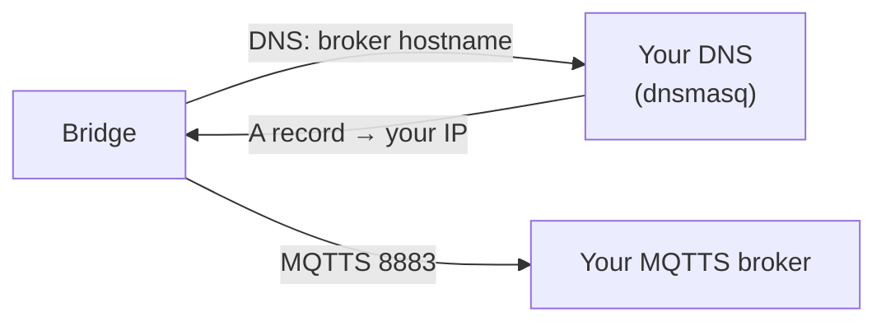

# Build your own AP / point the bridge's traffic at your host

The bridge is a normal WiFi station: you tell it an SSID+password (over BLE `WifiSet` or UART cmd 58)
and a broker `url` (in the `SetTMPCertificate` data). Two clean ways to make it reach *your* broker.

## Option A — set your broker URL directly (simplest)
`gen_certs.py` writes `ble_config.json` with `url = mqtts://<your-host>:8883`. When you push it
(`ble_provision.py` / the web tool), the device connects straight to your host. Just:
1. Put your broker machine on the same WiFi/LAN.
2. Set the bridge onto that WiFi (`--ssid/--password`).
3. Make sure the host's firewall allows **8883/tcp**.

No AP or DNS tricks needed — this is the recommended path.

## Option B — your own AP + DNS redirect (keep the vendor hostname)
Use this if you want the device to keep resolving the vendor broker hostname but land on your server
(e.g. you can't change the URL, or you want a drop-in intercept).



1. **Run an AP** the bridge joins — a spare router, a Raspberry Pi with `hostapd`, or a phone hotspot.
   Set the bridge onto it with `WifiSet`/cmd 58.
2. **Override DNS** so the broker hostname resolves to your host, e.g. `dnsmasq`:
   ```
   # /etc/dnsmasq.conf
   address=/<broker-hostname>/192.168.50.1
   ```
   Point the AP's DHCP DNS at this dnsmasq (or set it on the AP).
3. **Serve TLS with a cert the device trusts.** The device validates against the `caPem` you pushed
   over BLE, so your server cert must be signed by *your* CA (that's exactly what `gen_certs.py` does).
   The server cert's SAN must cover the address the device connects to (IP and/or the hostname) — the
   tool sets CN+SAN to `--host`.
4. Start `mqtts_server.py` on that host.

### Gotchas
- **Re-push after regenerating PKI.** `gen_certs.py` makes a *new CA* each run; the device still trusts
  the *old* `caPem` and will reject the new server cert with mbedTLS `-0x2700` /
  `SSLV3_ALERT_BAD_CERTIFICATE`. After any regen, re-run `ble_provision.py` so the device gets the new
  `caPem` + claim cert + `url`, **then** restart the server.
- **Host must be reachable on the WiFi you set**, on port 8883.
- Verify the chain: `openssl verify -CAfile pki/ca.pem pki/server.crt` → `OK`.
