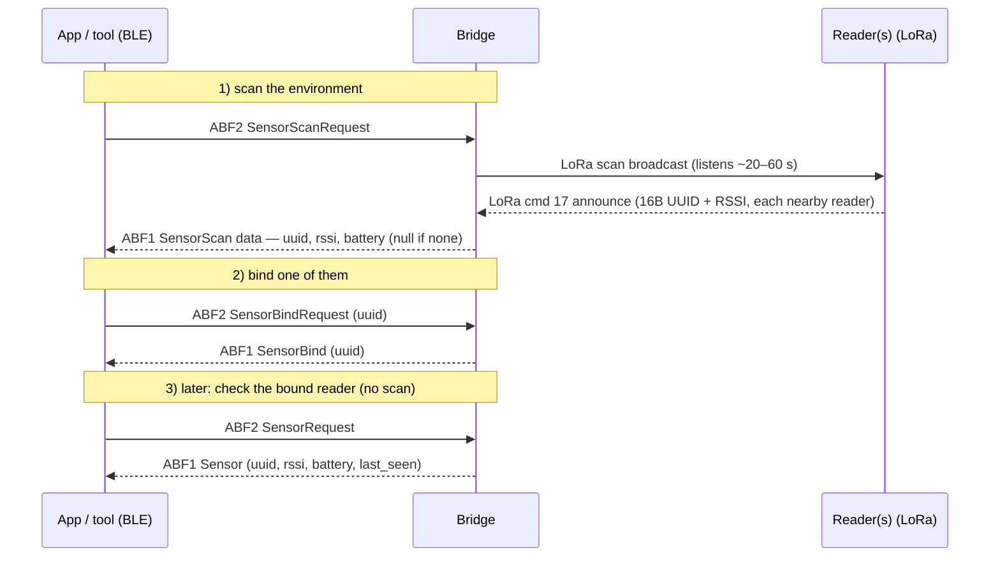

# 07 · Add a reader (sensor pairing over BLE)

Attaching a meter **reader** to a bridge over the **BLE control channel** (TEA + JSON). Three separate
commands are involved — don't confuse them:

| BLE command | id | What it does |
|---|---|---|
| **SensorScan** | 4 | **Actively scans the environment** — bridge broadcasts over LoRa and collects nearby readers that answer |
| **SensorBind** | 5 | **Binds** one reader by UUID (pairs it to this bridge) |
| **Sensor** (`SensorRequest`) | 6 | **Lists the current (already-bound) reader** and its live status — no scan |

You need the device's TEA key first ([04 · Step 0](../04-connect-your-own-cloud/README.md#step-0--get-the-devices-tea-key)).

> ✅ **Confirmed working on real hardware** — a reader paired successfully. Response shapes below match a
> live capture. Two details are still open: whether `SensorScan` can return **multiple** readers in one
> response (only one reader was present in the capture), and the exact units of `last_seen`.

> ⚠️ **Pairing is BLE-only and time-limited.** There is **no MQTT/cloud command to add a reader**
> (scan & bind exist only on the BLE JSON channel, proto 1). The bridge's BLE ("BleSwitch") is active only
> during a **setup window** (~120 s / while connected) and shuts off once it is operational — so **pair in
> the same BLE session as the cloud setup, or before it.** This is built into
> [`ble_provision.py --pair-sensor`](../04-connect-your-own-cloud/tools/ble_provision.py) — see the
> [own-cloud flow](../04-connect-your-own-cloud/README.md).

## Flow



## 1 · SensorScan (cmd 4) — scan the environment
Send `SensorScanRequest`. The bridge starts a LoRa scan (`lora_scan_broadcast`) and runs a worker for the
scan window (~20 s, up to ~60 s). Nearby readers answer over LoRa (**cmd 17**) with `[16-byte UUID][RSSI]`,
collected into the bridge's scan list.

**Response — `SensorScan`** (TEA-encrypted on ABF1):
```json
{ "type": "SensorScan", "data": { "uuid": "<uuid>", "rssi": <int>, "battery": <int> } }
```
`data` is `null` when nothing was found. In the current firmware the response carries the reader the bridge
selected; whether the app gets **all** nearby readers (list vs. repeated scans) is the open WIP part.

## 2 · SensorBind (cmd 5) — bind one
Send `SensorBindRequest` with the reader UUID from the scan:
```json
{ "type": "SensorBindRequest", "data": { "uuid": "<reader-uuid>" } }
```
The bridge matches the UUID in its scan list, stores the reader, and **derives that reader's 1-byte LoRa
frame key** (`sensor_bind_do` → `lora_derive_framekey`). Response:
```json
{ "type": "SensorBind", "data": { "uuid": "<reader-uuid>" } }
```
After binding, the reader must complete the **ECDH handshake (LoRa cmd 32)** before the bridge accepts its
energy data — see [../03-reverse-engineering/lora-protocol.md](../03-reverse-engineering/lora-protocol.md#ecdh--cmd-32-active-gate-unused-secret).

## 3 · Sensor / SensorRequest (cmd 6) — list the current reader
Send `SensorRequest` — this does **not** scan; it returns the currently **bound** reader and its live state
(`ble_sensor_request`):
```json
{ "type": "Sensor", "data": { "uuid": "<uuid>", "rssi": <int>, "battery": <int>, "last_seen": <ts> } }
```
`data` is `null` if no reader is bound. Use it to check what's paired and whether it's still reporting.

## What a real pairing looks like
A successful pairing from a live session (values sanitised). **Key point: binding is instant, but the
reader only starts reporting after a few minutes** — it first has to join over LoRa (ECDH `cmd 32` + its
first energy report), so be patient.

```
Status  → {firmware_version:"1.0.x", hardware_version:"6.0.0", connected_wifi:"…",
           wifi_set:true, persistent_cert_set:true}
Sensor  → data: null                                  # nothing bound yet
SensorScan (repeat, ~20–30 s each)
        → data: null            (a few times, while scanning)
        → data: {uuid:"<reader-uuid>", rssi:-99, battery:100}   # reader found
SensorBind {uuid}
        → {type:"SensorBind", data:{uuid:"<reader-uuid>"}}      # echoed immediately
Sensor  → {uuid, rssi:0, battery:0, last_seen:0}      # bound, but reader hasn't joined yet
   … ~3–4 minutes …
Sensor  → {uuid, rssi:-87, battery:100, last_seen:8843}   # reader is live, real data
```

Notes from the capture:
- **SensorScan is asynchronous.** It runs ~20–30 s; responses can also arrive unsolicited from the scan
  worker. Repeat `SensorScanRequest` until `data` is non-null.
- **UUID format is flexible.** The app sent both the dashed form (`aabbccdd-…-eeff`, 36 chars) and the plain
  32-hex form — both are accepted (internally the UUID is 16 bytes).
- **`rssi`/`battery`/`last_seen` stay 0 right after bind** and flip to real values once the reader's first
  LoRa report lands (the ~minutes delay). `last_seen` is a counter/timestamp (units TBD).
- Re-sending `SensorBindRequest` is harmless (idempotent) — the app spams it while waiting.

## Doing it with the tools
- CLI: [`ble_provision.py`](../04-connect-your-own-cloud/tools/ble_provision.py) pairs a reader **by default**
  as part of the cloud setup. It polls `SensorScanRequest`, collects **every** reader it sees, and prints a
  **numbered menu** so you pick which one to `SensorBind`:
  ```
  [+] reader found (1): 0011...aa   rssi=-71  battery=100
  [+] reader found (2): 0011...bb   rssi=-93  battery=90
    Pick a reader to bind [1-2], 'r'=rescan, 'q'=skip: 1
  ```
  Non-interactive: `--sensor-uuid <uuid>` (bind a specific one) or `--first` (bind the first seen);
  `--no-pair-sensor` skips pairing.
- Browser: [../06-tools/obi_gateway_ble.html](../06-tools/obi_gateway_ble.html) — enter the TEA key, then
  send `SensorScanRequest` → pick a UUID → `SensorBindRequest {uuid}` → verify with `SensorRequest`.
- Codec: [../06-tools/obi_ble_codec.py](../06-tools/obi_ble_codec.py) to build/parse the encrypted frames.

## To finish (reversing TODO)
- Confirm whether **SensorScan** returns **multiple** readers (list) or the app polls per reader.
- Nail the exact `SensorScanData` / `SensorData` schemas on a live device (units of rssi/battery, `last_seen` epoch).
- Verify unbind/rebind edge cases and scan-window timing.

> To *remove* the bridge from an owner use `UnbindRequest` (see [04](../04-connect-your-own-cloud/README.md)).
