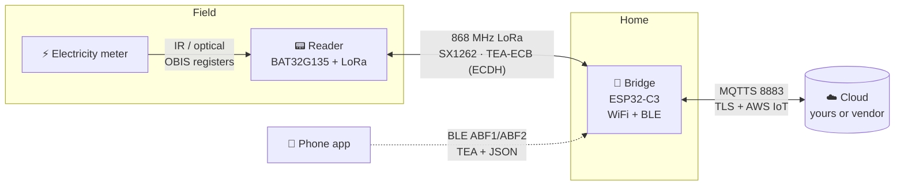

# OBI Energy Bridge — Reverse Engineering & Self-Hosting

Full teardown of the **OBI energy-tracking system**: a WiFi/BLE **bridge** (ESP32-C3) that relays data
from LoRa **meter readers** (BAT32G135) to an AWS-IoT cloud. This repo documents the protocols end-to-end
and shows how to **run the device against your own cloud** or **talk to the reader directly over
868 MHz** — so you actually own the hardware you bought.

> Sold under the **heyOBI** brand; the hardware is manufactured by **SUMEC** (<https://en.sumec.com/>) —
> which is why the reader firmware and cloud identifiers carry the `SUMEC` name.

> ⚠️ **Use on your own devices only.** See [DISCLAIMER.md](DISCLAIMER.md). All keys, certs, UUIDs and
> device IDs in this repo are **placeholders** (e.g. `00112233...EEFF`). Nothing here targets the
> vendor's cloud; the goal is local ownership and interoperability.

---
This repo is made together with these explanation videos:(click on the image)

[](https://www.youtube.com/watch?v=2jMEaRuSJ18)


[](https://www.youtube.com/watch?v=U4Vvf0kHnEk)


### ⚡ Want to **ditch the cloud completely?** → **[Open ESP32-C3 gateway firmware](open_obi_energy_meter/)**
Replaces the vendor bridge outright: pairs the LoRa readers itself, decodes the energy, and gives you a
**local web dashboard + MQTT / MQTTS** with Home-Assistant discovery — plus reader-OTA and self-update.
Runs on the **original OBI C3 hardware** and on generic ESP32 + SX1262 boards. Jump to the
[**step-by-step stock → custom guide**](#stock-to-custom) (EN + DE).

### 👉 Just want your own cloud working? → **[QUICKSTART.md](QUICKSTART.md)** (1‑to‑Done, start to finish)

### 🇩🇪 **Alles auf Deutsch → [ANLEITUNG.md](ANLEITUNG.md)** (Schritt‑für‑Schritt) · vollständige Doku unter **[de/](de/README.md)**

---

## The system in one picture



- **Meter → Reader:** the reader reads the electricity meter optically and decodes **OBIS / IEC-62056**
  registers (`1.8.x` import, `2.8.x` export, `16.7.0` power).
- **Reader → Bridge:** LoRa at 868 MHz (Semtech SX1262 / Ai-Thinker Ra-03SCH), a small framed protocol.
- **Bridge → Cloud:** MQTT over TLS (port 8883), AWS-IoT-style **fleet provisioning**.
- **Phone ↔ Bridge:** BLE GATT (service `ABF0`, chars `ABF1`/`ABF2`), payload is JSON wrapped in **TEA**.

## What you can do with this

| Goal | How | Section |
|---|---|---|
| **Point the bridge at your own MQTTS server** | Get the bridge's TEA key → push your CA + certs + broker URL over BLE → run your own broker | [04 · Connect your own cloud](04-connect-your-own-cloud/) |
| **Read the meter reader directly over 868 MHz** | Skip the cloud entirely; speak the LoRa protocol to the reader | [05 · LoRa direct (868 MHz)](05-lora-direct-868mhz/) |
| **Replace the bridge with your own ESP32** ✅ | Full mini-gateway firmware: pair readers, decode energy, web + MQTT, set interval, flash readers over the air | [Open OBI Energy Meter](open_obi_energy_meter/) |
| **Pair a reader to a bridge** ✅ | `SensorScan` (find) → `SensorBind` (pair) → `Sensor` (status) — verified on hardware | [07 · Add a reader](07-add-a-reader/) |
| **Understand / extend the firmware** | Protocols, frame formats, memory maps + IDA setup (bring your own dump) | [03 · Reverse engineering](03-reverse-engineering/) · [firmware/](firmware/) |

## Two ways to move the bridge onto your own cloud

Both need the device's **16-byte TEA key** (per bridge, encrypts the BLE control channel). Getting it is
easy — pick one:

1. **From the cloud** (any OBI login + the BLE name — the device need **not** be on your account): enter
   **email + password + BLE name `OBI-XXXXXX`** → `python tools/fetch_tea_key.py` prints the key. See
   [04 · Step 0](04-connect-your-own-cloud/README.md#step-0--get-the-devices-tea-key).
2. **From UART** (physical access): read it off the console — send cmd 49 or click one button in the
   [web tool](06-tools/obi_uart_config.html). See [03 · UART config](03-reverse-engineering/uart-config-protocol.md).

Once you have the key, the flow is: **unbind → set your WiFi → push your CA + claim cert + broker URL
(`SetTMPCertificate`) → run your MQTTS broker** that answers fleet-provisioning with a *consistent*
certificate. From then on everything works over MQTTS against your server. A **custom firmware** would
have to be delivered through that same cloud OTA path, because the ROM download mode is fused off (locked
bootloader) — see [04](04-connect-your-own-cloud/) and [03 · firmware layout](03-reverse-engineering/firmware-layout.md).

## 🔧 Turn the stock gateway into an open ESP32-C3 gateway (EN + DE) <a id="stock-to-custom"></a>

The flagship of this repo lives in **[`open_obi_energy_meter/`](open_obi_energy_meter/)**: a complete
open-source firmware that **replaces the vendor bridge entirely**. It runs on the **original OBI/heyOBI
ESP32-C3 hardware** *and* on off-the-shelf ESP32 + SX1262 boards, pairs the LoRa readers itself, decrypts
the energy payload, and serves a **local web dashboard + MQTT** — no vendor cloud, ever.

**What the firmware does**
- 📟 **Pairs & reads the meters over LoRa** (869.5 MHz) — does the ECDH + TEA key exchange and decodes
  energy on-device (both reader generations).
- 🌐 **Local web dashboard (DE/EN):** live import / export / power, battery, RSSI **+ SNR**, per-reader
  energy **history** with daily kWh & cost.
- 🔌 **MQTT with Home-Assistant auto-discovery** — including **MQTTS (TLS)** and **username / password**.
- 🔒 **Login screen** (session-based) protecting the whole dashboard.
- ⬆️ **OTA everywhere:** flash **readers over LoRa**, self-update the gateway from a **`.bin` or GitHub
  release**, and **factory-reset** from the web UI.
- 🧰 **Multi-board:** stock OBI C3, Heltec Vision Master E290 (e-paper), LILYGO T-Beam, Seeed XIAO S3, or
  any generic ESP32 / ESP32-S3 + SX1262. Build with `pio run -e obi_gateway_c3`.

Full firmware docs & build matrix: **[`open_obi_energy_meter/README.md`](open_obi_energy_meter/README.md)**.

### 🇬🇧 From stock gateway → custom firmware (step by step)

The stock C3 has a **locked bootloader** (ROM download mode fused off → no UART/JTAG flashing), so the
custom image is delivered **once**, through the device's own (now *yours*) **cloud OTA** path. After that
the firmware has its own built-in web updater and never needs a cloud again.

1. **Back up the stock image first** (so you can always restore / downgrade):
   `python 04-connect-your-own-cloud/tools/obi_ota_download.py`
2. **Get the device onto your own cloud** — follow **[04 · Connect your own cloud](04-connect-your-own-cloud/)**:
   fetch the TEA key → `gen_certs.py` → run `mqtts_server.py` → BLE-provision your WiFi + broker + CA.
3. **Build the firmware:**
   `cd open_obi_energy_meter && pio run -e obi_gateway_c3` → `.pio/build/obi_gateway_c3/firmware.bin`
4. **Push it over the cloud OTA path** (unsigned self-update → your image is accepted):
   `python 04-connect-your-own-cloud/tools/mqtts_server.py --host 0.0.0.0 --port 8883 --ota-firmware open_obi_energy_meter/.pio/build/obi_gateway_c3/firmware.bin`
   On its next connect the device pulls the image in chunks and reboots into it.
5. **Done — it's now an open local gateway.** It comes up as the **`OpenOBI-XXXXXX`** WiFi setup portal →
   join it, set your WiFi / MQTT, open the dashboard. From now on **all** updates go through
   **Settings → Firmware** (upload a `.bin` or pull a GitHub release) — **no cloud needed**.

> ⚠️ Step 4 is the only destructive step — a wrong image can't be re-flashed over UART. Keep the stock
> backup from step 1.

### 🇩🇪 Vom Stock-Gateway → eigene Firmware (Schritt für Schritt)

Der originale C3 hat einen **gesperrten Bootloader** (ROM-Download-Modus per eFuse deaktiviert → kein
Flashen über UART/JTAG). Die eigene Firmware wird deshalb **einmalig über den Cloud-OTA-Weg** aufgespielt —
über *deine* eigene Cloud. Danach hat die Firmware ihren eigenen Web-Updater und braucht nie wieder eine Cloud.

1. **Zuerst das Stock-Image sichern** (zum Wiederherstellen / Downgraden):
   `python 04-connect-your-own-cloud/tools/obi_ota_download.py`
2. **Gerät auf deine eigene Cloud bringen** — nach **[04 · Connect your own cloud](04-connect-your-own-cloud/)**:
   TEA-Key holen → `gen_certs.py` → `mqtts_server.py` starten → per BLE WLAN + Broker + CA provisionieren.
3. **Firmware bauen:**
   `cd open_obi_energy_meter && pio run -e obi_gateway_c3` → `.pio/build/obi_gateway_c3/firmware.bin`
4. **Über den Cloud-OTA-Weg aufspielen** (unsigniertes Self-Update → dein Image wird akzeptiert):
   `python 04-connect-your-own-cloud/tools/mqtts_server.py --host 0.0.0.0 --port 8883 --ota-firmware open_obi_energy_meter/.pio/build/obi_gateway_c3/firmware.bin`
   Beim nächsten Verbinden zieht das Gerät das Image in Blöcken und startet damit neu.
5. **Fertig — jetzt ein offenes lokales Gateway.** Es startet als WLAN-Setup-Portal **`OpenOBI-XXXXXX`** →
   verbinden, WLAN / MQTT einstellen, Dashboard öffnen. Ab jetzt laufen **alle** Updates über
   **Einstellungen → Firmware** (`.bin` hochladen oder GitHub-Release ziehen) — **ohne Cloud**.

> ⚠️ Schritt 4 ist der einzige unumkehrbare Schritt — ein falsches Image lässt sich nicht über UART neu
> flashen. Sicherung aus Schritt 1 aufbewahren.

## Repository layout

```
01-architecture/            System + data-flow diagrams (cloud & LoRa, who talks to whom)
02-hardware/                ESP32-C3, BAT32G135, SX1262/Ra-03, pinouts, 868 MHz
03-reverse-engineering/     Protocols: BLE, LoRa, UART config, firmware layout
04-connect-your-own-cloud/  Manual + tools: MQTTS broker, PKI, BLE provisioning, own AP/DNS
05-lora-direct-868mhz/      Talk to the reader over the air, no cloud
06-tools/                   Web tools (UART config, BLE gateway) + BLE TEA codec
07-add-a-reader/            Pair a meter reader over BLE (SensorScan / SensorBind / Sensor) — verified
open_obi_energy_meter/      Standalone ESP32 + SX1262 firmware that REPLACES the bridge (web + MQTT + reader OTA)
firmware/                   Loader script + IDA notes (no vendor binaries — dump your own)
```

## Quick starts

- **Own cloud:** [`04-connect-your-own-cloud/README.md`](04-connect-your-own-cloud/README.md)
- **Decode BLE traffic:** [`06-tools/obi_ble_codec.py`](06-tools/obi_ble_codec.py) + [tools README](06-tools/README.md)
- **Read/write UART config in the browser:** open [`06-tools/obi_uart_config.html`](06-tools/obi_uart_config.html) in Chrome/Edge
- **Load your own firmware dump in IDA:** [`firmware/README.md`](firmware/README.md)

## Firmware coverage & status → [STATUS.md](STATUS.md)
- **Covers:** bridge **1.0.0–1.2.1** and **31.0.0–34.0.0**; protocol details are from **1.0.2**, verified
  consistent across versions.
- 🔒 **No vendor firmware binaries are included** (SUMEC/OBI copyright) — dump the image from a device you
  own; see [firmware/README.md](firmware/README.md).
- ⚠️ **Firmware can change** — a future OTA may alter ids/payloads or add crypto. Re-verify on your unit.
- **OTA is still unsigned** in the newest analyzed version (integrity hash only, no secure-boot signature) —
  which is what makes custom firmware via your own cloud possible. This could change.
- ✅ **Energy data over MQTT is decoded** — JSON telemetry confirmed on a live device (meter readings on
  `EnergyTrackingSensor/.../state`; schema in [cloud-api.md](03-reverse-engineering/cloud-api.md#telemetry-payloads-decoded--confirmed-on-a-live-device)).
- 🚧 **In progress:** **talking to the bridge over MQTT** — two downlink commands are reversed & verified:
  change the reader **upload interval** (`mqtts_server.py --set-interval N`) and **push firmware over OTA**
  (`mqtts_server.py --ota-firmware fw.bin` — unsigned self-update, so a real custom-firmware path; see
  [flash firmware](04-connect-your-own-cloud/README.md#flash-your-own-firmware) /
  [OTA protocol](03-reverse-engineering/cloud-api.md#ota)). Remaining command payloads and pinning the
  `energy` **unit** still open. Roadmap in [STATUS.md](STATUS.md).

## Security posture (factual summary)
The BLE control channel uses **TEA** (single 16-byte key per device, and that key is also retrievable from
the vendor cloud with just a login + the BLE name — no ownership check). The **LoRa energy payload is
TEA-encrypted with a per-device ECDH-derived key on both reader generations** — the old readers (cloud
firmware `1.0.1`, softver `32`/"v32") do the same ECDH → TEA-ECB as `1.2.x`; only the frame layout differs
(an earlier "old readers are single-byte-XOR only" claim was **wrong**, corrected after building the ESP32
gateway). The single-byte XOR is only an outer frame obfuscation. The plaintext **UART config channel can read/write
the TEA key and WiFi credentials**. Details and impact are in
[03-reverse-engineering](03-reverse-engineering/). These notes exist so owners can secure and self-host their units.
