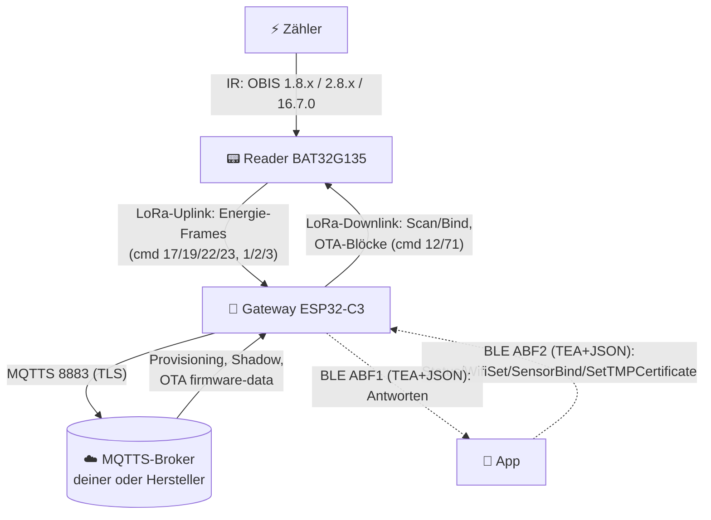
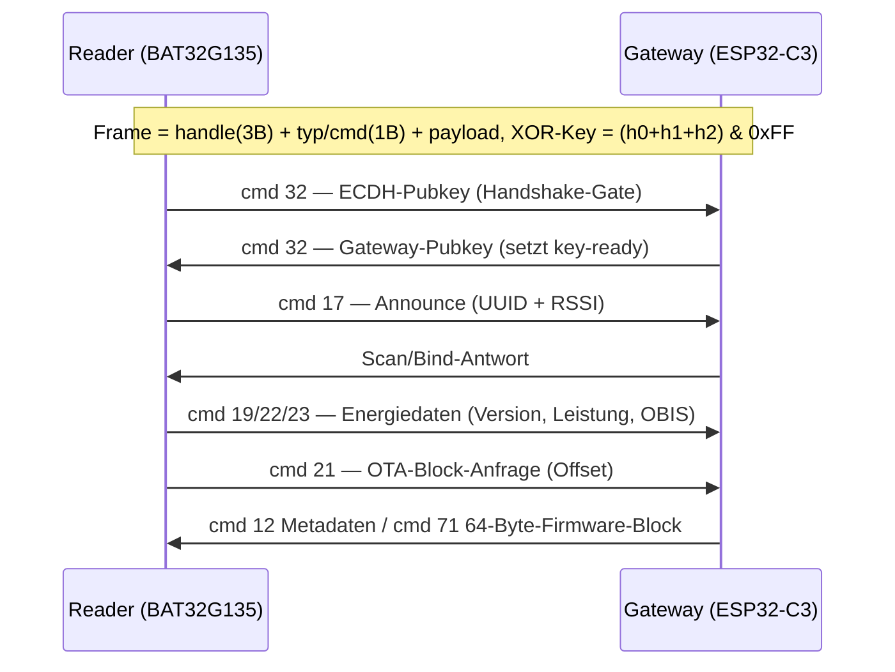
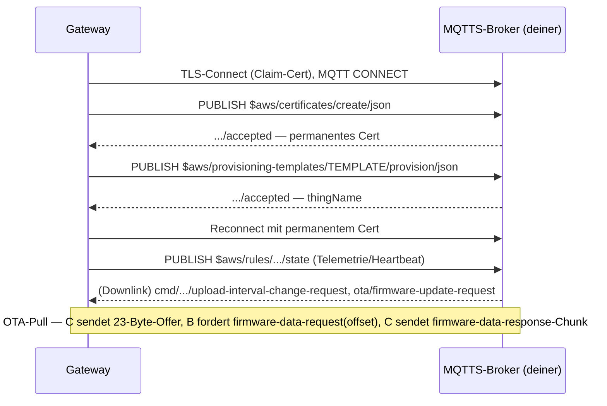
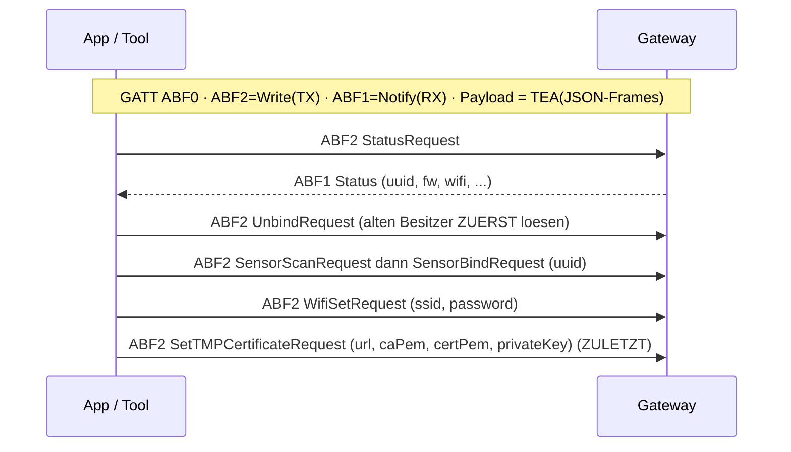

# 01 · Architektur & Datenfluss (🇩🇪)

Wie alles zusammenhängt und **was in welche Richtung fließt**. Drei Links: Zähler↔Reader (IR),
Reader↔Gateway (LoRa 868 MHz), Gateway↔Cloud (MQTTS), plus App↔Gateway (BLE) für das Setup.

## Komponenten
| Knoten | Chip | Rolle |
|---|---|---|
| **Zähler** | — | Stromzähler mit optischer/IR‑Schnittstelle (DLMS/OBIS) |
| **Reader** | BAT32G135 (ARM Cortex‑M0+) + SX1262 | Liest den Zähler, sendet Energie per LoRa |
| **Gateway** | ESP32‑C3 (RISC‑V) + SX1262 (Ra‑03SCH) | LoRa ↔ WLAN/BLE ↔ Cloud |
| **Cloud** | AWS IoT (Hersteller) **oder dein MQTTS‑Broker** | Provisioning + Telemetrie + OTA |
| **App** | heyOBI | BLE‑Setup: WLAN, Zertifikate, Sensor‑Bind |

> **Firmware 1.2.x** erweitert das: ein Gateway bedient jetzt **mehrere Sensoren gleichzeitig** und ergänzt
> **Smart‑Outlets** (Relais + Leistungsmessung). Die Telemetrie wechselte auf `schema_version: 2`
> (`paired_devices[]` mit `device`‑Typ, `upload_interval`, `outlet/…`‑Topics), und Downlink‑Kommandos sind
> **pro Gerät** (sie tragen die Ziel‑`uuid`). Siehe
> [03-cloud-api.md](03-cloud-api.md#downlink-kommandos-cloud--gerät). Die Links unten sind über die
> Versionen unverändert.

## Gesamt‑Datenfluss

## Wer sendet was (Richtungen)

### LoRa (Reader ↔ Gateway, 868 MHz)

Details & Payload‑Layouts: [03-lora-protokoll.md](03-lora-protokoll.md).

### Cloud (Gateway ↔ MQTTS)

Topics & Self‑Hosting: [04-eigene-cloud.md](04-eigene-cloud.md).

### BLE (App ↔ Gateway, Setup)

Codec + Command‑Liste: [03-ble-protokoll.md](03-ble-protokoll.md).

## Transporte & das interne „vsocket"
Eine Framing‑Schicht (**vsocket**), gemultiplext über eine *Pipe‑ID* und verteilt über eine *Protokoll*‑Nummer:

| Pipe (Transport) | Protokoll | erreichbar über |
|---|---|---|
| 1 | BLE‑JSON (TEA) | BLE ABF2 |
| 0 | Proto 2 — Management / OTA‑aus‑Cloud | MQTT / BLE Pipe 0 |
| 2 | Proto 254 — Klartext‑Config | **UART0‑Konsole** |
| (LoRa) | Proto 0 — Reader‑Commands | 868‑MHz‑Funk |

Deshalb tauchen dieselben OTA‑/Command‑Handler auf mehreren Links auf. Referenz:
[03-firmware-layout.md](03-firmware-layout.md).
