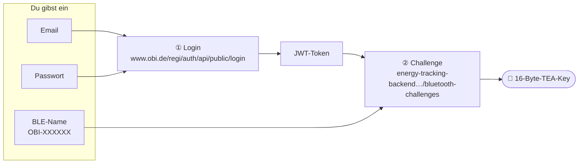
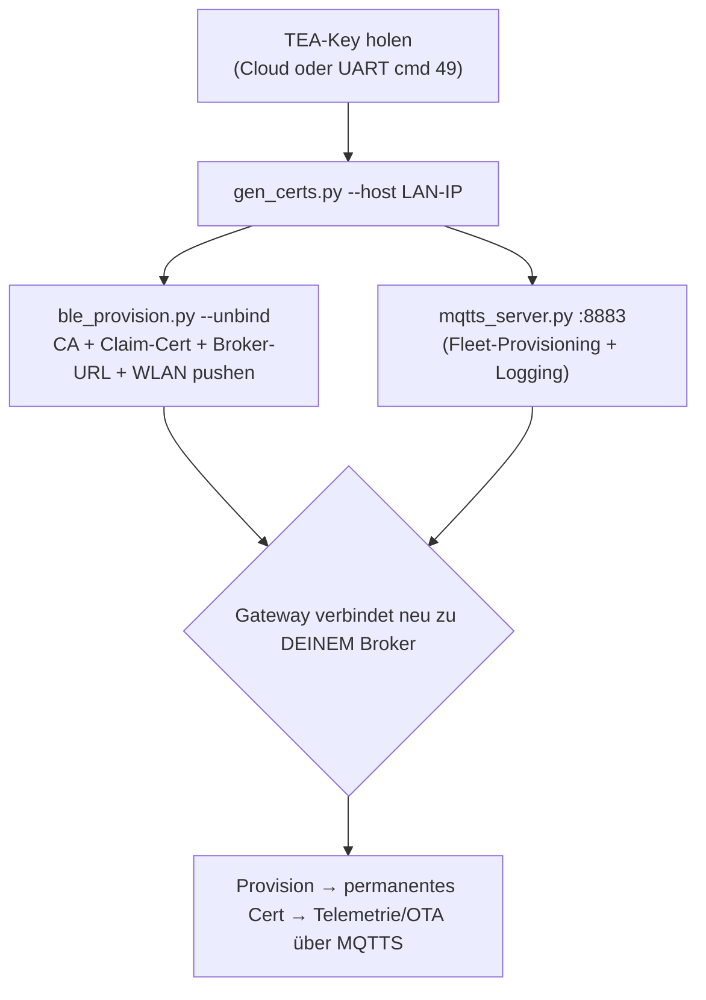

# 04 · Eigene Cloud anbinden (🇩🇪)

Das Gateway auf **deinen** MQTTS‑Broker statt der Hersteller‑Cloud bringen — damit deine Energiedaten lokal
bleiben und dir das Gerät gehört.

> ➡️ **Kompaktes Schritt‑für‑Schritt‑Manual: [../ANLEITUNG.md](../ANLEITUNG.md)** (1‑to‑Done). Diese Seite
> ist die ausführliche Referenz.

## Schritt 0 — TEA‑Key des Geräts holen
Alles Weitere braucht den **16‑Byte‑TEA‑Key** (verschlüsselt den BLE‑Steuerkanal; einer pro Gerät). Zwei
Wege — der Cloud‑Weg ist am einfachsten und braucht keinen Hardware‑Zugang.

### Weg 1 — aus der Cloud (am einfachsten — nur OBI‑Login + BLE‑Name nötig)
Du brauchst nur **drei Dinge**: eine OBI‑Email, das Passwort und den **BLE‑Namen** — das `OBI-XXXXXX`, das
das Gerät ausstrahlt (mit einem beliebigen BLE‑Scanner auslesen — er steht *nicht* auf dem Gerät). Dieser Name *ist* die Challenge‑ID. Das
Gerät muss **nicht** auf deinem Konto registriert sein — jedes gültige OBI‑Login funktioniert, und der
Endpunkt gibt den Key für das angefragte `OBI-XXXXXX` zurück (siehe [03-security.md](03-security.md)).



**Am einfachsten — ein Script, drei Eingaben:**
```bash
python tools/fetch_tea_key.py
#   OBI account email:            deine@mail.de
#   OBI account password:         ********
#   Device BLE name (OBI-XXXXXX): OBI-XXXXXX
#   → TEA key for OBI-XXXXXX: 00112233445566778899AABBCCDDEEFF
```

**Oder per Hand (curl):**
```bash
# ① einloggen → Token
TOKEN=$(curl -s https://www.obi.de/regi/auth/api/public/login \
  -H 'content-type: application/json' -H 'x-app-type: b2c' \
  -d '{"email":"deine@mail.de","password":"DEIN_PASSWORT","country":"DE"}' | jq -r .token)

# ② Gerät-Key anfragen (jedes gültige Login + BLE-Name; keine Konto-Besitz-Prüfung)
curl -s https://energy-tracking-backend.prod-eks.dbs.obi.solutions/bluetooth-challenges \
  -H "authorization: Bearer $TOKEN" \
  -H 'accept: application/vnd.obi.companion.energy-tracking.bluetooth-challenge.v1+json' \
  -H 'content-type: application/json' \
  -d '{"btChallengeId":"OBI-XXXXXX"}'
# → {"key":"<32 hex = dein 16-Byte-TEA-Key>"}
```
Hinweis: der Endpunkt prüft **keinen** Geräte‑Besitz — ein gültiges Login plus der `OBI-XXXXXX`‑Name reicht,
um den Key des Geräts zu bekommen. Nutze es für dein eigenes Gerät. (Der UART‑Weg unten braucht gar keine Cloud.)

### Weg 2 — per UART (physischer Zugang zum Gateway)
Ohne Konto: `C5 5C 00 08 00 00 FE 31` (cmd 49) auf UART0 senden, oder im
[../06-tools/obi_uart_config.html](../06-tools/obi_uart_config.html) auf **„Read IDs & TEA key"** klicken.
Details: [03-uart-config.md](03-uart-config.md).

### Außerdem nötig
- Ein Rechner im selben LAN wie das Gateway (dein Broker‑Host).
- Python: `pip install cryptography bleak paho-mqtt`.

## Der Ablauf


1. **PKI erzeugen** (CA, Server‑Cert für deine LAN‑IP, Claim‑Cert, festes „permanentes" Cert, `ble_config.json`):
   ```bash
   cd tools
   python gen_certs.py --host 192.168.1.50        # LAN-IP deines Brokers
   ```
2. **Broker starten** (TLS 8883, beantwortet `$aws/certificates/create` und `…/provision`, loggt alles):
   ```bash
   python mqtts_server.py --host 0.0.0.0 --port 8883
   ```
3. **Config per BLE pushen** — WLAN setzen, CA + Claim‑Cert + Broker‑`url` übergeben und im selben Schritt
   vom vorigen Besitzer **entbinden**:
   ```bash
   python ble_provision.py --config pki/ble_config.json --key <TEA-KEY> --unbind \
       --ssid <dein-wlan> --password <dein-wlan-pw>
   ```
   (Oder das Web‑Tool [../06-tools/obi_gateway_ble.html](../06-tools/obi_gateway_ble.html) und die
   `SetTMPCertificate`‑Felder aus `ble_config.json` einfügen.)

Danach: Gateway ins WLAN → `mqtts://<dein-host>:8883` → `CreateKeysAndCertificate` + `RegisterThing` → dein
**permanentes** Cert → Reconnect → Telemetrie. Alles im Broker‑Log sichtbar. Ab hier läuft alles über
**MQTTS gegen deinen Server**.

## Zum „consistent" (festen) Cert
`gen_certs.py` erzeugt ein **permanentes Cert, das der Broker jedes Mal zurückgibt** — das Gerät hat immer
dieselbe Identität, kein Neu‑Churn. `mqtts_server.py` antwortet auf `$aws/certificates/create` mit diesem
Cert und auf den Provisioning‑Publish mit einem `thingName`.

## Eigene Firmware flashen <a id="eigene-firmware-flashen"></a>
Der ROM‑Download‑Modus ist per eFuse gesperrt (siehe [03-firmware-layout.md](03-firmware-layout.md)), also
**kein** Reflash über UART/JTAG. Aber das MQTT‑Selbst‑Update ist **unsigniert** (nur Integritäts‑Hash) —
ein Gerät an *deiner* Cloud akzeptiert also jedes Image, das du auslieferst. `mqtts_server.py` kann eins
pushen:

```bash
# Gerät ist bereits gegen deinen Broker provisioniert (Schritte oben). Dann:
python mqtts_server.py --host 0.0.0.0 --port 8883 --ota-firmware fw.bin
```
Wenn das Gerät (neu) verbindet und subscribed, schickt der Server den 23‑Byte‑Offer, das Gerät ackt und
zieht das Image in 512‑Byte‑Chunks, und bei 100 % rebootet es in `fw.bin`. Im Log erscheinen
`-> OTA offer …`, eine Reihe `-> OTA chunk offset=…  [LAST …]`, dann verbindet das Gerät auf der neuen
Version. Das genaue Wire‑Protokoll: [03-cloud-api.md#ota](03-cloud-api.md#ota).

**An echter Hardware verifiziert:** eine Bridge wurde so `1.0.1 → 1.2.1` geflasht — sie bootete das neue
Image (`system start! soft version:1.2.1` auf UART) und meldete danach `firmware_version: "1.2.1"`.

Zwei Dinge nimmt dir das Tool ab (beide auf die harte Tour gelernt):
- **Es bietet nach 100 % nicht erneut an.** Nach dem letzten Chunk setzt es ein Done‑Flag; wenn das frisch
  geflashte Gerät rebootet und neu subscribed, bekommt es **nicht** denselben Offer nochmal — sonst gäbe es
  eine Reflash‑Schleife. Der Server kann laufen bleiben.
- **Die Bridge updatet danach evtl. den *Reader*.** Nach dem Reboot zog die 1.2.x‑Bridge ein **Reader**‑
  Image über denselben `firmware-data-request`‑Kanal (anderer `offset`‑Strom) und flashte den Reader über
  LoRa (`upgradeserver device … upgrade success`, Reader `32.0.0 → 57.0.0`). Servierst du das nicht, laufen
  die Requests einfach in einen Timeout — folgenlos. Reader‑Images serviert dieses Tool noch nicht.

**Ein Image zum Flashen bekommen:**
- **Stock‑Image** (zum Wiederherstellen, Downgrade oder Studieren): vom Hersteller ziehen mit
  [`tools/obi_ota_download.py`](../04-connect-your-own-cloud/tools/obi_ota_download.py) — spielt den OTA‑Client
  des Geräts mit einem Cloud‑Cert für deine Bridge (aus `POST /device-provisionings`).
- **Vom eigenen Gerät dumpen** (kein Cert nötig, sobald die Custom‑Firmware läuft): die Web‑Debug‑Seite
  kann den ganzen SPI‑Flash lesen — beide OTA‑Slots, also bekommst du die laufende *und* die vorherige
  Firmware‑Version. Schritt für Schritt + wie man den Dump in einzelne Partitionen splittet:
  [04-flash-dumpen.md](04-flash-dumpen.md).
- **Custom‑Image**: jedes gültige ESP32‑C3‑App‑Partition‑Image (beginnt mit `0xE9`), gegen diese Hardware
  gebaut. `--ota-version` setzt nur den Versions‑String im Offer (kosmetisch).

> ⚠️ **Das flasht dein Gateway wirklich neu — der einzige destruktive Schritt hier.** Ein falsches oder
> inkompatibles Image kann das Gerät den neuen Slot nicht booten lassen. Absicherung: die Boot‑Partition
> wird erst bei 100 % umgeschaltet (vorher abbrechen ist sicher), und ESP‑IDF‑App‑Rollback kann ein Image
> zurücknehmen, das sich nicht bestätigt — aber mach das bewusst, am besten nachdem du das aktuelle
> Stock‑Image gesichert hast. Nichts hiervon zielt auf den Hersteller; eigenes Gerät, eigene Cloud.

## MITM‑Variante (Gerät bleibt in der App „echt")
`mitm_proxy.py` sitzt zwischen Gerät und echter Cloud: das Gerät provisioniert lokal gegen dich, während du
eine echte Cloud‑Verbindung als Thing des Geräts hältst und App‑Traffic durchreichst — so bleibt das
Gateway in der App online, während du in der Mitte alles siehst/änderst. Walkthrough:
[04-tools.md](04-tools.md).

Siehe auch: [04-eigener-ap.md](04-eigener-ap.md) für die WLAN/DNS‑Seite.
