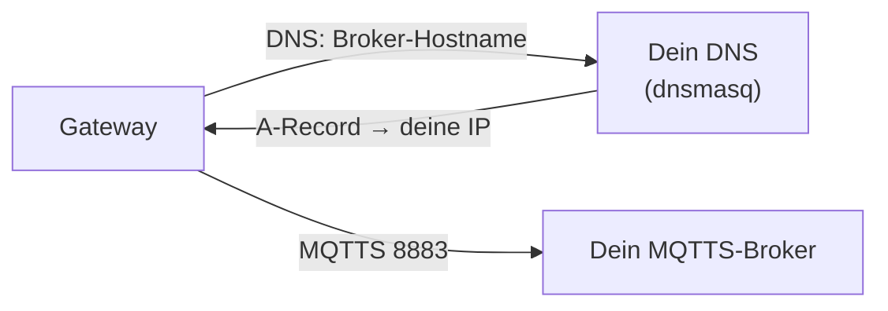

# Eigenen AP bauen / Traffic auf deinen Host lenken (🇩🇪)

Das Gateway ist eine normale WLAN‑Station: du gibst ihm SSID+Passwort (per BLE `WifiSet` oder UART cmd 58)
und eine Broker‑`url` (in den `SetTMPCertificate`‑Daten). Zwei saubere Wege, damit es *deinen* Broker
erreicht.

## Variante A — Broker‑URL direkt setzen (am einfachsten)
`gen_certs.py` schreibt `ble_config.json` mit `url = mqtts://<dein-host>:8883`. Beim Pushen
(`ble_provision.py` / Web‑Tool) verbindet sich das Gerät direkt zu dir. Nur:
1. Broker‑Rechner ins selbe WLAN/LAN.
2. Gateway auf dieses WLAN setzen (`--ssid/--password`).
3. Firewall des Hosts: **8883/tcp** offen.

Kein AP‑ oder DNS‑Trick nötig — der empfohlene Weg.

## Variante B — eigener AP + DNS‑Redirect (Vendor‑Hostname behalten)
Nutze das, wenn das Gerät weiter den Vendor‑Hostnamen auflösen, aber bei dir landen soll.

1. **AP betreiben**, dem das Gateway beitritt — Ersatzrouter, Raspberry Pi mit `hostapd`, oder Handy‑Hotspot.
   Gateway per `WifiSet`/cmd 58 darauf setzen.
2. **DNS überschreiben**, sodass der Broker‑Hostname auf deinen Host zeigt, z. B. `dnsmasq`:
   ```
   # /etc/dnsmasq.conf
   address=/<broker-hostname>/192.168.50.1
   ```
   Das DHCP‑DNS des AP auf diesen dnsmasq zeigen lassen.
3. **TLS mit einem Cert, dem das Gerät vertraut.** Das Gerät prüft gegen die per BLE gepushte `caPem`, also
   muss dein Server‑Cert von *deiner* CA signiert sein (genau das macht `gen_certs.py`). Der SAN des
   Server‑Certs muss die Adresse abdecken, zu der das Gerät verbindet (IP und/oder Hostname) — das Tool
   setzt CN+SAN auf `--host`.
4. `mqtts_server.py` auf diesem Host starten.

### Stolpersteine
- **Nach PKI‑Regenerieren neu pushen.** `gen_certs.py` macht je Lauf eine *neue CA*; das Gerät vertraut noch
  der *alten* `caPem` und lehnt das neue Server‑Cert ab (mbedTLS `-0x2700` / `BAD_CERTIFICATE`). Nach jedem
  Regen also `ble_provision.py` erneut, **dann** den Server neu starten.
- **Host muss im gesetzten WLAN auf 8883 erreichbar sein.**
- Chain prüfen: `openssl verify -CAfile pki/ca.pem pki/server.crt` → `OK`.
