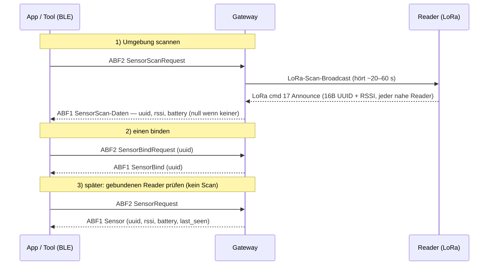

# 07 · Reader hinzufügen (Sensor‑Kopplung über BLE)

Einen Zähler‑**Reader** über den **BLE‑Steuerkanal** (TEA + JSON) an ein Gateway koppeln. Es sind **drei
getrennte Commands** beteiligt — nicht verwechseln:

| BLE‑Command | ID | Was es tut |
|---|---|---|
| **SensorScan** | 4 | **Scannt aktiv die Umgebung** — Gateway broadcastet per LoRa und sammelt nahe Reader, die antworten |
| **SensorBind** | 5 | **Bindet** einen Reader per UUID (koppelt ihn an dieses Gateway) |
| **Sensor** (`SensorRequest`) | 6 | **Listet den aktuell gebundenen Reader** und seinen Live‑Status — kein Scan |

Du brauchst zuerst den TEA‑Key des Geräts ([04 · Schritt 0](04-eigene-cloud.md#schritt-0--tea-key-des-geräts-holen)).

> ✅ **An echter Hardware bestätigt** — ein Reader hat erfolgreich gekoppelt. Die Antwortformate unten
> stimmen mit einem Live‑Mitschnitt überein. Zwei Details noch offen: ob `SensorScan` **mehrere** Reader in
> einer Antwort liefern kann (im Mitschnitt war nur einer da) und die genaue Einheit von `last_seen`.

> ⚠️ **Pairing geht nur über BLE.** Es gibt **kein MQTT/Cloud‑Kommando, um einen Reader hinzuzufügen** (Scan &
> Bind existieren nur im BLE‑JSON‑Kanal, Proto 1). Das BLE des Gateways („BleSwitch") ist nur im
> **Setup‑Fenster** aktiv (~120 s / solange verbunden) und geht aus, sobald das Gateway im Betrieb ist.
>
> 🔘 **BLE jederzeit wieder aktivieren — Button ~5 s halten.** Am echten Gateway den **Button ~5 Sekunden
> gedrückt halten, um BLE wieder zu aktivieren**. Das öffnet das Setup‑Fenster erneut — für die **allgemeine
> Konfiguration** *und* das **Hinzufügen weiterer Sensoren**. Du musst also **nicht** im allerersten
> Setup‑Vorgang koppeln: Wann immer du einen weiteren Reader hinzufügen (oder neu konfigurieren) willst,
> Button halten, per BLE neu verbinden, dann scannen/binden. Eingebaut in
> [`ble_provision.py --pair-sensor`](../04-connect-your-own-cloud/tools/ble_provision.py) — siehe den
> [Eigene‑Cloud‑Ablauf](04-eigene-cloud.md).

## Ablauf


## 1 · SensorScan (cmd 4) — Umgebung scannen
`SensorScanRequest` senden. Das Gateway startet einen LoRa‑Scan (`lora_scan_broadcast`) und läuft für das
Scan‑Fenster (~20 s, bis ~60 s). Nahe Reader antworten per LoRa (**cmd 17**) mit `[16‑Byte‑UUID][RSSI]`,
gesammelt in der Scan‑Liste.

**Antwort — `SensorScan`** (TEA‑verschlüsselt auf ABF1):
```json
{ "type": "SensorScan", "data": { "uuid": "<uuid>", "rssi": <int>, "battery": <int> } }
```
`data` ist `null`, wenn nichts gefunden. In der aktuellen Firmware trägt die Antwort den vom Gateway
ausgewählten Reader; ob die App **alle** nahen Reader bekommt (Liste vs. Wiederhol‑Scans), ist der offene
WIP‑Teil.

## 2 · SensorBind (cmd 5) — einen binden
`SensorBindRequest` mit der Reader‑UUID aus dem Scan:
```json
{ "type": "SensorBindRequest", "data": { "uuid": "<reader-uuid>" } }
```
Das Gateway matcht die UUID in der Scan‑Liste, speichert den Reader und **leitet dessen 1‑Byte‑LoRa‑Key
ab** (`sensor_bind_do` → `lora_derive_framekey`). Antwort:
```json
{ "type": "SensorBind", "data": { "uuid": "<reader-uuid>" } }
```
Nach dem Binden muss der Reader den **ECDH‑Handshake (LoRa cmd 32)** abschließen, bevor das Gateway seine
Energiedaten annimmt — siehe [03-lora-protokoll.md](03-lora-protokoll.md).

## 3 · Sensor / SensorRequest (cmd 6) — aktuellen Reader listen
`SensorRequest` senden — das **scannt nicht**; es liefert den aktuell **gebundenen** Reader und seinen
Live‑Status (`ble_sensor_request`):
```json
{ "type": "Sensor", "data": { "uuid": "<uuid>", "rssi": <int>, "battery": <int>, "last_seen": <ts> } }
```
`data` ist `null`, wenn kein Reader gebunden ist. So prüfst du, was gekoppelt ist und ob es noch meldet.

## So sieht eine echte Kopplung aus
Eine erfolgreiche Kopplung aus einer Live‑Session (Werte sanitisiert). **Kernpunkt: das Binden ist sofort,
aber der Reader meldet erst nach ein paar Minuten** — er muss zuerst per LoRa joinen (ECDH `cmd 32` +
erster Energie‑Report), also Geduld.

```
Status  → {firmware_version:"1.0.x", hardware_version:"6.0.0", connected_wifi:"…",
           wifi_set:true, persistent_cert_set:true}
Sensor  → data: null                                  # noch nichts gebunden
SensorScan (wiederholen, ~20–30 s je)
        → data: null            (ein paar Mal, während des Scans)
        → data: {uuid:"<reader-uuid>", rssi:-99, battery:100}   # Reader gefunden
SensorBind {uuid}
        → {type:"SensorBind", data:{uuid:"<reader-uuid>"}}      # sofort bestätigt
Sensor  → {uuid, rssi:0, battery:0, last_seen:0}      # gebunden, aber Reader noch nicht drin
   … ~3–4 Minuten …
Sensor  → {uuid, rssi:-87, battery:100, last_seen:8843}   # Reader ist live, echte Daten
```

Beobachtungen aus dem Mitschnitt:
- **SensorScan ist asynchron.** Läuft ~20–30 s; Antworten können auch unaufgefordert vom Scan‑Worker
  kommen. `SensorScanRequest` wiederholen, bis `data` nicht `null` ist.
- **UUID‑Format ist flexibel.** Die App sendet die Bindestrich‑Form (`aabbccdd-…-eeff`, 36 Zeichen) **und** die
  reine 32‑Hex‑Form — beide werden akzeptiert (intern ist die UUID 16 Byte).
- **`rssi`/`battery`/`last_seen` bleiben direkt nach dem Bind 0** und springen auf echte Werte, sobald der
  erste LoRa‑Report des Readers ankommt (die ~Minuten‑Verzögerung). `last_seen` ist ein Zähler/Timestamp
  (Einheit offen).
- `SensorBindRequest` erneut zu senden ist harmlos (idempotent) — die App spammt es beim Warten.

## Mit den Tools
- CLI: [`ble_provision.py`](../04-connect-your-own-cloud/tools/ble_provision.py) koppelt einen Reader
  **standardmäßig** im Zuge der Cloud‑Einrichtung. Es pollt `SensorScanRequest`, sammelt **alle** gesehenen
  Reader und zeigt ein **nummeriertes Menü** zur Auswahl, welcher `SensorBind` bekommt:
  ```
  [+] reader found (1): 0011...aa   rssi=-71  battery=100
  [+] reader found (2): 0011...bb   rssi=-93  battery=90
    Pick a reader to bind [1-2], 'r'=rescan, 'q'=skip: 1
  ```
  Nicht‑interaktiv: `--sensor-uuid <uuid>` (bestimmten binden) oder `--first` (ersten gesehenen);
  `--no-pair-sensor` überspringt das Koppeln.
- Browser: [../06-tools/obi_gateway_ble.html](../06-tools/obi_gateway_ble.html) — TEA‑Key eintragen, dann
  `SensorScanRequest` → UUID wählen → `SensorBindRequest {uuid}` → mit `SensorRequest` prüfen.
- Codec: [../06-tools/obi_ble_codec.py](../06-tools/obi_ble_codec.py) zum Bauen/Parsen der Frames.

## Firmware 1.2.x — die `Devices*`‑Familie und Bind‑Interna (reversed)
`1.2.x` behält die Einzel‑Commands `SensorScan`/`SensorBind`/`SensorRequest`/`Unbind` **und** ergänzt eine
generische Multi‑Device‑Familie für die gemischte Sensor+**Outlet**‑Welt: `DevicesScanRequest`,
`DevicesBindRequest`, `DevicesUnbindRequest`, `DevicesRequest` (BLE cmds 9–12). Der Unterschied ist nur
einzeln vs **Batch**:

- `SensorBindRequest {uuid}` bindet **ein** Gerät.
- `DevicesBindRequest {devices:[{uuid},{uuid},…]}` bindet **mehrere** in einem Aufruf und antwortet
  `{"type":"DevicesBind","data":{"devices":[{uuid},…]}}` (nur die erfolgreichen), loggt
  `dealBindDevices success, bind N/M devices`.

Beide laufen über denselben Kern **`lora_scan_bind`** (Firmware `ScanBind`):
1. die `uuid` muss bereits in der **LoRa‑Scan‑Liste** stehen (durch einen vorherigen `…ScanRequest`, als das
   Gerät über LoRa announced) — sonst `bind device fail! uuid not in scan list`;
2. nicht schon gebunden (`device already bind` = Erfolg);
3. **höchstens 10 gepaarte Geräte** (`bind device fail! devices num max`);
4. dann im Paired‑Cache mit `id` + `type` (`0x10` Meter / `0x11` Outlet) gespeichert und persistiert
   (`platsa save devices success`).

Auf 1.2.x sind „Reader hinzufügen" und „Outlet hinzufügen" also **derselbe** Scan→Bind‑Pfad — nur der
Gerätetyp im Scan‑Listen‑Eintrag unterscheidet sich. Pairing bleibt BLE‑only (kein MQTT‑Weg), siehe
[STATUS.md](STATUS.md).

## Noch zu erledigen (Reversing‑TODO)
- Die genauen `SensorScanData` / `SensorData`‑Schemas an echter Hardware verifizieren (Einheiten von
  rssi/battery, `last_seen`‑Epoch).
- Unbind/Rebind‑Edge‑Cases und Scan‑Timing prüfen.

> Zum *Entfernen* des Gateways vom Besitzer `UnbindRequest` nutzen (siehe [04](04-eigene-cloud.md)).
