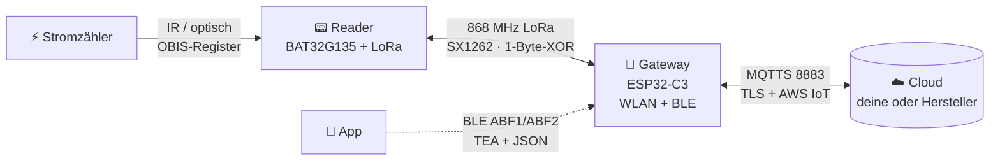

# OBI Energy Bridge — Reverse Engineering & Eigene Cloud (🇩🇪)

Komplette Analyse des **OBI‑Energy‑Tracking‑Systems**: ein WLAN/BLE‑**Gateway** (ESP32‑C3), das Daten von
LoRa‑**Zähler‑Readern** (BAT32G135) an eine AWS‑IoT‑Cloud weiterreicht. Dieses Repo dokumentiert die
Protokolle End‑to‑End und zeigt, wie man das Gerät **an die eigene Cloud** hängt oder **direkt per 868 MHz**
mit dem Reader spricht — damit dir die gekaufte Hardware wirklich gehört.

> Verkauft unter der Marke **heyOBI**; die Hardware stammt von **SUMEC** (<https://en.sumec.com/>) — daher
> der `SUMEC`‑Name in Reader‑Firmware und Cloud‑IDs.

> ⚠️ **Nur eigene Geräte.** Siehe [../DISCLAIMER.md](../DISCLAIMER.md). Alle Keys/Zertifikate/UUIDs sind
> **Platzhalter**. Ziel ist lokale Kontrolle über die eigene Hardware.

> ➡️ **Einfachste Schritt‑für‑Schritt‑Anleitung: [../ANLEITUNG.md](../ANLEITUNG.md)** (1‑to‑Done).

## Das System auf einen Blick

- **Zähler → Reader:** liest den Stromzähler optisch und dekodiert **OBIS/IEC‑62056** (`1.8.x` Bezug,
  `2.8.x` Einspeisung, `16.7.0` Leistung).
- **Reader → Gateway:** LoRa 868 MHz (Semtech SX1262 / Ai‑Thinker Ra‑03SCH).
- **Gateway → Cloud:** MQTT über TLS (8883), AWS‑IoT‑Fleet‑Provisioning.
- **App ↔ Gateway:** BLE GATT (Service `ABF0`, Chars `ABF1`/`ABF2`), Payload = JSON in **TEA**.

Einige erklärungen im Video format gibt es hier:(Zur weiterleitung einfach aufs bild clicken)

[](https://www.youtube.com/watch?v=2jMEaRuSJ18)


[](https://www.youtube.com/watch?v=U4Vvf0kHnEk)

## Was möglich ist
| Ziel | Wie | Sektion |
|---|---|---|
| **Gateway auf eigenen MQTTS‑Server** | TEA‑Key holen → eigene CA+Certs+URL per BLE pushen → eigener Broker | [04 · Eigene Cloud](04-eigene-cloud.md) |
| **Reader direkt per 868 MHz lesen** | Ohne Cloud: das LoRa‑Protokoll direkt sprechen | [05 · LoRa direkt](05-lora-direkt.md) |
| **Bridge durch eigenen ESP32 ersetzen** ✅ | Vollständige Mini‑Gateway‑Firmware: Reader koppeln, Energie dekodieren, Web + MQTT, Intervall setzen, Reader per Funk flashen | [Open OBI Energy Meter](../open_obi_energy_meter/) |
| **Reader an ein Gateway koppeln** ✅ | `SensorScan` (finden) → `SensorBind` (koppeln) → `Sensor` (Status) — an Hardware verifiziert | [07 · Reader koppeln](07-reader-koppeln.md) |
| **Firmware verstehen/erweitern** | Protokolle, Frame‑Formate, Memory‑Maps, IDA‑fertige Images | [03 · Reversing](03-reverse-engineering.md) · [firmware/](../firmware/) |

## Zwei Wege, das Gateway auf die eigene Cloud zu bringen
Beide brauchen den **16‑Byte‑TEA‑Key** des Geräts (siehe [04 · Schritt 0](04-eigene-cloud.md)):
1. **Aus der Cloud** (jedes OBI‑Login + BLE‑Name — das Gerät muss **nicht** auf deinem Konto sein):
   Email + Passwort + BLE‑Name `OBI-XXXXXX` → `python tools/fetch_tea_key.py` gibt den Key aus.
2. **Per UART** (physischer Zugang): cmd 49 auf der Konsole, oder ein Klick im
   [Web‑Tool](../06-tools/obi_uart_config.html).

Danach: **unbind → eigenes WLAN → eigene CA+Claim‑Cert+Broker‑URL pushen → eigener MQTTS‑Broker**. Custom‑
Firmware nur über die eigene Cloud‑OTA (Bootloader per eFuse gesperrt).

## Repo‑Aufbau
```
01-architektur.md          System- & Datenfluss-Diagramme
02-hardware.md             ESP32-C3, BAT32G135, SX1262/Ra-03, Pinouts, 868 MHz
03-reverse-engineering.md  Protokolle: BLE, LoRa, UART-Config, Firmware-Layout (+ Detailseiten)
04-eigene-cloud.md         Manual + Tools: MQTTS-Broker, PKI, BLE-Provisioning, eigener AP/DNS
05-lora-direkt.md          Direkt per Funk mit dem Reader, ohne Cloud
06-tools.md                Web-Tools (UART-Config, BLE-Gateway) + BLE-TEA-Codec
07-reader-koppeln.md       Reader per BLE koppeln (SensorScan / SensorBind / Sensor) — verifiziert
../open_obi_energy_meter/  Eigenständige ESP32+SX1262-Firmware, die die Bridge ERSETZT (Web + MQTT + Reader-OTA)
../firmware/               Loader-Script + IDA-Notizen (keine Vendor-Binaries — eigenes Dump)
```

## Firmware‑Abdeckung & Status → [STATUS.md](STATUS.md)
- **Abgedeckt:** Gateway **1.0.0–1.2.1** und **31.0.0–34.0.0**; Protokoll‑Details aus **1.0.2**, über die
  Versionen konsistent geprüft.
- 🔒 **Keine Firmware‑Binaries im Repo** (SUMEC/OBI‑Copyright, aus Sicherheitsgründen entfernt und
  git‑ignoriert) — eigenes Dump mitbringen, siehe [firmware.md](firmware.md).
- ⚠️ **Firmware kann sich ändern** — ein künftiges OTA kann IDs/Payloads ändern oder Krypto hinzufügen.
  Gegen die eigene Einheit gegenprüfen.
- **OTA ist weiterhin unsigniert** in der neuesten analysierten Version (nur Integritäts‑Hash, keine
  Secure‑Boot‑Signatur) — genau das macht Custom‑Firmware über die eigene Cloud möglich. Kann sich ändern.
- ✅ **Stromdaten über MQTT sind dekodiert** — JSON‑Telemetrie an echtem Gerät bestätigt (Zählerwerte auf
  `EnergyTrackingSensor/.../state`; Schema in [03-cloud-api.md](03-cloud-api.md)).
- 🚧 **In Arbeit:** **mit dem Gateway über MQTT sprechen** — zwei Downlink‑Kommandos sind reversed &
  verifiziert: Reader‑**Upload‑Intervall** ändern (`mqtts_server.py --set-interval N`) und **Firmware per
  OTA** einspielen (`mqtts_server.py --ota-firmware fw.bin` — unsigniertes Selbst‑Update, also ein echter
  Custom‑Firmware‑Weg; siehe [Firmware flashen](04-eigene-cloud.md#eigene-firmware-flashen) /
  [OTA‑Protokoll](03-cloud-api.md#ota)). Restliche Command‑Payloads und die `energy`‑**Einheit** noch
  offen. Roadmap in [STATUS.md](STATUS.md).

## Sicherheits‑Kurzfassung
BLE‑Steuerkanal nutzt **TEA** (ein 16‑Byte‑Key pro Gerät — der zudem mit nur Login + BLE‑Name aus der
Hersteller‑Cloud abrufbar ist, ohne Besitz‑Prüfung). Der **LoRa‑Link ist auf `1.0.x`/`3x.x` nur mit
1‑Byte‑XOR obfuskiert** (ECDH‑Secret ungenutzt) — **`1.2.x` hat das gefixt**: LoRa ist dort TEA‑verschlüsselt
mit einem per‑Device‑ECDH‑Key. Der Klartext‑**UART‑Config‑Kanal kann TEA‑Key und WLAN‑Daten lesen/schreiben**.
Details: [03 · Reversing](03-reverse-engineering.md). Diese Hinweise dienen dazu, eigene Geräte
abzusichern/selbst zu hosten.
