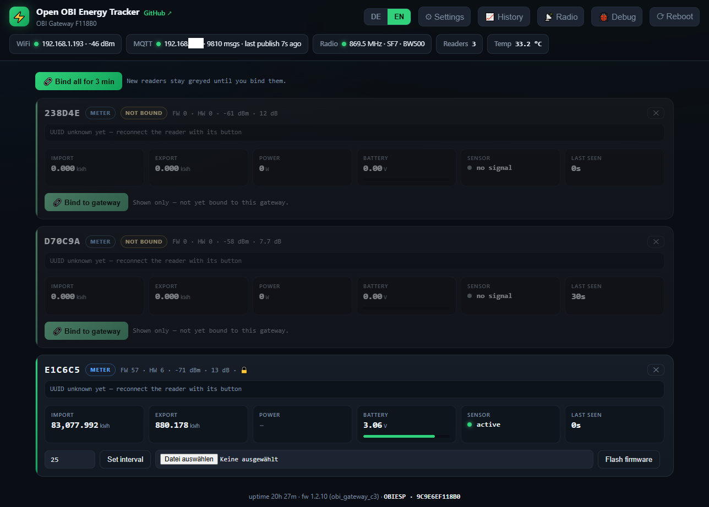
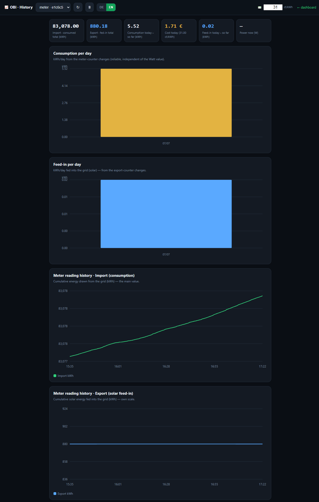
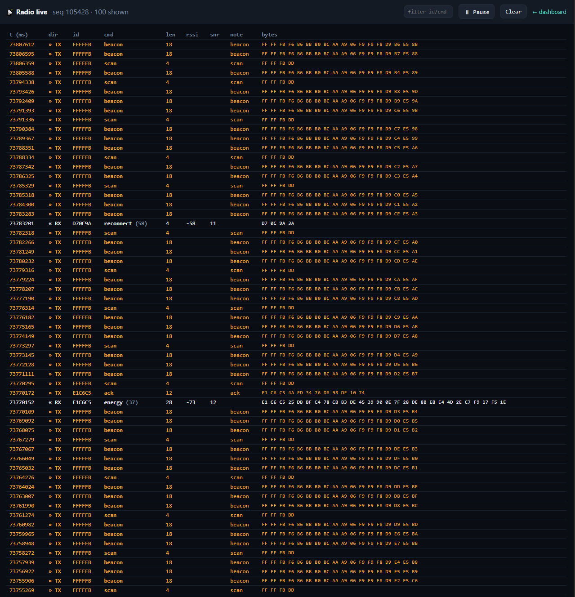
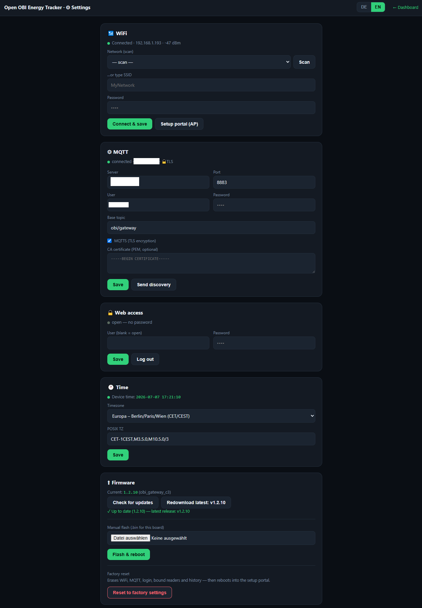
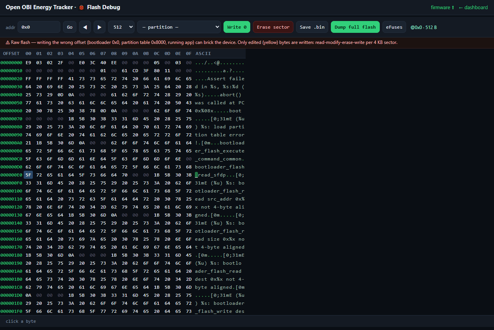

<a name="english"></a>
# Open OBI Energy Meter — ESP32 + SX1262 LoRa gateway

A **standalone firmware** for any ESP32 + Semtech SX1262 that fully **replaces the OBI/heyOBI bridge**.
It speaks the reader's proprietary LoRa protocol directly (pairing, ECDH, TEA decryption, energy decode),
serves a **web dashboard + MQTT**, lets you **set each reader's upload interval**, and can **flash reader
firmware over the air** — including rescuing a reader that is stuck in its bootloader. No vendor bridge, no
vendor cloud.

> ✅ **You don't need any new hardware — it also runs on the *original* OBI/heyOBI ESP32-C3 gateway.**
> Flash the stock unit you already own (env `obi_gateway_c3`) and your **entire** setup — readers, gateway
> and Home Assistant — becomes **100 % local, with no cloud ever again.** See
> [**Run it on the original OBI gateway**](#stock-c3) below.

**🌐 Language:** **English** (below) · **[Deutsch ↓](#deutsch)**

> ⚠️ **Use on your own devices only.** Region-regulated RF — operate within your local 868 MHz ISM rules
> (duty cycle etc.). No vendor firmware binaries are shipped here; reader images you flash must come from a
> device you own (see [`../firmware/`](../firmware/)).

---

## Screenshots — the Custom firmware running on a stock OBI Gateway

Everything below is served straight from the ESP32 — no app, no cloud. Open `http://<gateway-ip>/` in any
browser (phone or desktop), pick DE/EN with the toggle top-right.

### Dashboard — live readers


The home page. A status strip up top shows **WiFi**, **MQTT** (broker + message count + last publish),
**Radio** (869.5 MHz · SF7 · BW500), reader count and the C3's die temperature. Each meter reader gets a
card with its **import / export / power**, **battery** (with a charge bar), **optical-sensor** state and
**last-seen** age. New readers show up greyed-out until you press **Bind** (or *Bind all for 3 min*); a
bound reader also exposes a **Set interval** field and a **Flash firmware** picker right on its card.

### History — daily kWh & cost


Per-reader history built on-device from the meter counters. Stat tiles for **consumed total**, **fed-in
total**, **today's consumption**, **today's cost** (at a ct/kWh price you set), and today's feed-in.
Below: **consumption per day** and **feed-in per day** bar charts, plus the raw **cumulative import** and
**export** meter-reading curves. All computed from the counter deltas, so it's independent of the
instantaneous Watt value.

### Radio live — raw LoRa traffic


A live monitor of every LoRa frame the gateway sends and receives — the master's 1 Hz **beacon** and
**scan**, and the readers' **reconnect / energy / ack** frames — with direction, reader id, command
name+number, length, **RSSI/SNR** and the raw bytes. Invaluable for watching a reader pair or debugging
range. Filter by id/cmd, pause, or clear.

### Settings — WiFi, MQTT(S), login, time, firmware


One page for everything: **WiFi** (scan/join or captive AP), **MQTT** with optional **MQTTS/TLS**, a CA
field and *Send discovery*, a **web-access login** to lock the dashboard, **timezone**, and the **Firmware**
block — *check for updates* / pull a GitHub release / manually flash a `.bin`, plus a **factory reset**.

### Debug — raw flash tool & full backup


A power-user flash inspector: browse raw flash as hex, read **eFuses**, and — most importantly — **Dump
full flash** to pull a complete backup of the device (bootloader + partition table + both OTA app slots +
NVS). Because the partition table is dual-OTA, your **original stock firmware is still intact in the other
slot** after conversion, so this is how you grab a full stock backup straight from the device.

---

## What it does

The OBI system is a star network: a mains-powered **bridge** is the master, and battery **readers**
(BAT32G135, sitting on your electricity meter's optical port) are clients that wake up on a beacon-synced
schedule and report energy. This firmware **is that master.** It is not LoRaWAN — the modules are LoRa PHY
only, the protocol on top is a proprietary OBI protocol (own framing, command dispatch, XOR + TEA crypto,
bind + ECDH). Everything was reverse-engineered from firmware `1.2.1`; details in
[`../03-reverse-engineering/lora-protocol.md`](../03-reverse-engineering/lora-protocol.md).

## Features

| # | Feature | Notes |
|---|---|---|
| 1 | **Full bridge replacement** | 1 Hz time beacon, scan, announce/reconnect, bind, mutual **ECDH (P-256)** key exchange |
| 2 | **Both reader generations** | `1.2.x` and the legacy v32 reader (cloud "1.0.1"/softver `32`) — **both TEA-ECB with a per-device ECDH key**, only the frame layout differs; auto-detected |
| 3 | **Energy decode** | import / export / power, battery, firmware/hardware version, infrared & low-power flags |
| 4 | **Set upload interval** | per reader, from the web UI **or** MQTT — rides the encrypted energy-ACK the reader already waits for |
| 5 | **Reader firmware OTA over LoRa** | flash your own reader image; all three pull protocols served; can **un-brick** a reader stuck in its bootloader |
| 6 | **Web dashboard** | WiFi captive-portal setup, live reader cards, interval + firmware controls, DE/EN toggle |
| 7 | **MQTT + Home Assistant** | publishes each reader as JSON; **HA auto-discovery** (sensors, binary sensors, availability + a settable interval `number`) so devices appear automatically; **command topic** to set the interval remotely |
| 8 | **Persistence** | reader UUIDs + MQTT settings saved in NVS, survive reboots |
| 9 | **Board-generic** | any ESP32 / ESP32-S3 + SX1262 via `board_config.h`; not tied to one vendor board |
| 10 | **On-board e-paper** | Heltec Vision Master E290 2.9″ display shows live gateway + reader status (auto-detected via the board flag; other boards unaffected) |

## Hardware & wiring

Any ESP32 (classic or S3) plus a **Semtech SX1262** module. You need seven GPIOs plus the TCXO voltage.
Presets live in [`include/board_config.h`](include/board_config.h); pick one with a build flag.

| Signal | Heltec Vision Master E290 / V3 (`OBI_BOARD_HELTEC_S3`) | LILYGO T-Beam / T3 (`OBI_BOARD_TTGO_TBEAM_SX1262`) |
|---|---|---|
| NSS  | 8  | 18 |
| SCK  | 9  | 5  |
| MOSI | 10 | 27 |
| MISO | 11 | 19 |
| RST  | 12 | 23 |
| BUSY | 13 | 32 |
| DIO1 | 14 | 33 |
| TCXO | DIO3 @ 1.8 V | DIO3 @ 1.8 V |
| RF switch | DIO2 | DIO2 |

For any other wiring, edit the `OBI_BOARD_CUSTOM` block (set `LORA_TCXO_V 0.0f` if your module has a plain
crystal, not a TCXO).

### Radio parameters (reversed from `reader_v1.2.1`, exact)

| Frequency | Modem | BW | SF | CR | Preamble | Header | CRC | IQ | Sync word | TX power |
|---|---|---|---|---|---|---|---|---|---|---|
| **869.500 MHz** | LoRa | **500 kHz** | **7** | **4/5** | **12** | explicit | on | normal | **0x1424** (private / `0x12`) | +22 dBm |

## Quick start

```bash
# 1. Install PlatformIO (once)
pip install platformio

# 2. Build + flash for your board (from this folder)
pio run -e vision_master_e290 -t upload      # Heltec Vision Master E290 (ESP32-S3 + SX1262)
pio run -e ttgo_tbeam_sx1262  -t upload      # LILYGO T-Beam / T3
pio run -e generic_esp32s3    -t upload      # your own wiring (edit board_config.h → OBI_BOARD_CUSTOM)
pio run -e generic_esp32      -t upload      # classic ESP32 + your own wiring
pio run -e obi_gateway_c3                    # ★ the ORIGINAL OBI/heyOBI C3 gateway — flashed differently, see below

# 3. Watch the serial log
pio device monitor -b 115200
```

> ★ The stock `obi_gateway_c3` build has **no `-t upload`** — the original gateway's bootloader is locked,
> so it's flashed over the network instead. See [**Run it on the original OBI gateway**](#stock-c3).

**First boot:** the device opens a WiFi setup portal named **`OpenOBI-<MAC>`** (e.g. `OpenOBI-3AF4C2`, the
last 3 bytes of the device MAC so two gateways never clash) at `192.168.4.1`. Join it,
enter your WiFi (and optionally MQTT), save. The dashboard is then at the IP printed on the serial log
(`http://<device-ip>/`). LoRa runs immediately — turn the vendor bridge **off** and the readers will
re-pair to this gateway on their own within a minute.

## Run it on the *original* OBI gateway (locked C3) → fully local <a id="stock-c3"></a>

**No extra hardware needed:** this firmware also runs on the **stock OBI/heyOBI ESP32-C3 gateway** you
already bought. Convert it once and the whole chain — readers → gateway → Home Assistant — is **100 %
local, no cloud, ever.**

The stock C3 has a **locked bootloader** (ROM download mode fused off → **no UART/JTAG flashing**), so the
open image is delivered **one time** over the device's **own cloud-OTA path — pointed at *your* server, not
the vendor's.** OTA on the stock firmware is unsigned (integrity CRC only), which is exactly what makes this
self-update possible. The full step-by-step (bring the device onto your own cloud → get the `.bin` → push it →
optionally back up the stock image afterward from the device's Debug page) is in the top-level README:

- 🇬🇧 / 🇩🇪 **[Stock gateway → custom firmware, step by step](../README.md#stock-to-custom)**

You don't even need the toolchain — **download the prebuilt C3 image from the
[Releases page](https://github.com/atc1441/OBI_Energy_Tracker_Local_Cloud/releases)**, or build it yourself:

```bash
pio run -e obi_gateway_c3     # -> .pio/build/obi_gateway_c3/firmware.bin  (no -t upload: the C3 can't take UART)
```

**After that first cloud-OTA it is 100 % local — it never needs a cloud again.** The firmware carries its
own web updater, so every later update just goes through **Settings → Firmware** (upload a `.bin` or pull a
GitHub release), or a `POST /api/selfupdate` with the new `firmware.bin`. A wrong image is rejected and the
running firmware kept (brick-safe dual-OTA). The build → flash → verify loop and endpoint details live in
[`PROJECT_NOTES.md`](PROJECT_NOTES.md).

## Web dashboard

- **WiFi captive portal** (WiFiManager) — no hard-coded credentials; reconfigurable any time.
- **Live reader cards**: 3-byte id, 16-byte **UUID**, device type, firmware/hardware version, RSSI,
  battery, infrared (meter-reading) status, and import / export / power.
- **Per reader**: set the **upload interval**, **flash firmware** (`.bin` picker → over-the-air update), and
  **delete** the reader (✕) — handy for a phantom created by a bad RX. Delete only frees the slot (and clears
  its Home Assistant entities); it is **not** a permanent block, so a real reader reappears on its next frame.
- **Bootloader badge**: a reader that reset into its OTA bootloader is shown with a ⚙ *"Bootloader mode —
  ready to flash"* badge so you can (re)arm firmware for it even though it isn't sending energy.
- **MQTT panel** (⚙): configure host/port/user/pass/base-topic and see live status (connected, last
  publish, message count); a **Send discovery** button re-publishes all Home Assistant discovery configs.
- **DE/EN toggle**, remembered in the browser.
- **Night mode** in Settings disables the WiFi heartbeat and LoRa receive flashes of the status LED; setup, OTA and error indications remain active.
- The web/MQTT stack runs on **core 0** while LoRa runs on **core 1**, so HTTP traffic never stutters the
  radio timing.

### On-board e-paper display (Heltec Vision Master E290)

If you build the `vision_master_e290` env, the 2.9″ e-paper (DEPG0290BNS800 / SSD1680, 296×128) shows a live
status page: **WiFi IP** (or the setup-AP hint), **MQTT** state, reader count, and a line per reader with its
id, import/export (kWh), infrared status, RSSI and battery. It runs on **core 0** on its **own SPI bus**
(pins in [`include/board_config.h`](include/board_config.h)), so it never touches the LoRa timing. To spare the
slow, wear-prone panel it only redraws when the shown values change (flicker-free partial refresh, with an
occasional full refresh to clear ghosting). Other boards are unaffected — the display code is gated behind the
`OBI_HAS_EPD` board flag and the GxEPD2 library is only pulled for the Heltec env.

## Setting the upload interval

Two ways, same effect (the value is delivered inside the TEA-encrypted energy-ACK that the reader already
waits ~300 ms for after each report):

- **Web UI** — type seconds into a reader card and press *Interval*.
- **MQTT** — publish the seconds as the payload to `‹base›/‹id›/set_interval`:

  ```bash
  mosquitto_pub -h 192.168.1.91 -u USER -P PASS \
    -t obi/gateway/238d4e/set_interval -m 30
  ```
  `‹base›` is your configured base topic (default `obi/gateway`), `‹id›` the 6-hex reader id. The gateway
  logs `mqtt rx set_interval 238d4e -> 30 s` and applies it on the reader's next report.

## MQTT integration

- **Publish**: every reader is published as JSON to `‹base›/‹id›` (e.g. `obi/gateway/d70c9a`):
  ```json
  {"id":"d70c9a","uuid":"…","type":"meter","battery_mV":3080,"rssi":-74,
   "infrared":true,"import":83049758,"export":875840,"power":null,
   "softver":57,"hardver":6,"paired":true,"legacy":false,"bootloader":false,"interval":30,"age_s":5}
  ```
- **Availability**: an LWT topic `‹base›/status` carries `online` / `offline` (the broker publishes
  `offline` if the gateway drops), so Home Assistant marks the entities *unavailable* automatically.
- **Subscribe**: `‹base›/+/set_interval` (see above).
- **Status** is exposed on `/api/status` (`connected`, `state`, `pub_count`, `last_pub_s`) and shown in the
  dashboard MQTT panel.
- All settings are configurable in the web UI and persisted in NVS.

### Home Assistant auto-discovery

The gateway also publishes **retained MQTT discovery configs** under the `homeassistant/…/config` prefix, so
every reader shows up **automatically** as a Home Assistant device — no manual YAML. The state stays the single
JSON above; each discovery entity just points a `value_template` at one of its fields.

- **Prefix is fixed** to `homeassistant/` and is **independent of your base topic** — leave the base topic at
  its default (`obi/gateway`); do **not** set it to `homeassistant/…`.
- Entities created per reader (grouped under one device *"OBI meter ‹id›"*):
  - **Sensors**: Import, Export (energy, **Wh**, `total_increasing`), Power (W); plus diagnostics Battery (V),
    RSSI (dBm), Last seen (s), UUID, Type, Firmware and Hardware (shown separately, e.g. FW 57 / HW 6).
  - **Binary sensors** (diagnostic): Optical sensor, Paired, Legacy protocol, Bootloader mode.
  - **Number — Upload interval**: writes seconds to `‹base›/‹id›/set_interval`, so you can change the interval
    straight from Home Assistant (1–65535 s).
- Discovery is (re)sent automatically after every MQTT (re)connect and when a new reader first reports. The
  MQTT panel also has a **"Send discovery"** button next to *Save* to push all configs on demand.
- Import/export are reported as raw **Wh** (`total_increasing`), matching the meter's native unit — divide by
  1000 in HA if you prefer kWh. Null/`n/a` readings are guarded, so a missing value never pushes a bogus `0`.

## Reader firmware OTA over LoRa

Pick a reader's `.bin`, press **Flash firmware**, confirm the warning. The gateway advertises the new
version in the energy-ACK; after three acks the reader resets into its **bootloader** and pulls the image
block-by-block, which the gateway serves. The reader validates the image (CRC) **before** writing, so a
bad file is rejected, not bricked.

Three pull protocols are implemented and verified — the gateway answers whichever the reader uses:

| Reader request | Gateway response | Block layout |
|---|---|---|
| cmd 33 (newer) | cmd 34 | `[type][offset:4][ver][64 B][crc16]` (crc after block) |
| cmd 21 (bootloader) | cmd 53 | `[offset:4][f1][crc16][64 B]` (crc before block) |
| cmd 20 | cmd 52 | `[offset:4][ver][64 B]` (no crc) |

A reader that is **already stuck in its bootloader** (begging with cmd 20/21/33) is picked up
automatically: it appears on the dashboard in bootloader mode, so you can arm an image and recover it.
This was verified live — a reader that would not boot was pulled to a known-good version and came back
online. Reader images must be dumped from a device you own; see [`../firmware/`](../firmware/).

## Architecture & source files

The firmware is split so the radio state machine and the network stack never block each other.

| File | Responsibility |
|---|---|
| [`src/main.cpp`](src/main.cpp) | LoRa state machine: RX dispatch, beacon/scan/bind TX, ECDH, energy decode + ACK, OTA serving |
| [`include/obi_proto.h`](include/obi_proto.h) | Frame build/parse, `obi_crc16` (MODBUS split-table), `obi_xor`, TEA-ECB encrypt/decrypt (little-endian words) |
| [`include/obi_ecdh.h`](include/obi_ecdh.h) · [`src/obi_ecdh.cpp`](src/obi_ecdh.cpp) | mbedTLS secp256r1 key-pair + shared secret (TEA key = first 16 bytes of shared X) |
| [`include/reader.h`](include/reader.h) | Shared `Reader` state (identity, key, telemetry, interval, bootloader flag) + the web↔LoRa API |
| [`include/gateway_web.h`](include/gateway_web.h) · [`src/gateway_web.cpp`](src/gateway_web.cpp) | WiFiManager portal, HTTP dashboard, REST API, MQTT client (publish + command RX) — pinned to core 0 |
| [`include/board_config.h`](include/board_config.h) | Pin presets per board |
| [`platformio.ini`](platformio.ini) | Build envs + library deps (RadioLib, WiFiManager, PubSubClient) |

**Key functions in `main.cpp`:** `sendBeacon` (cmd 15), `sendScan` (36), `sendBind` (59),
`sendEcdhReply` (32), `sendEnergyAck` (38/40, TEA-encrypted, carries interval + version), `serveOtaRequest`
(cmd 33→34), `serveOtaLegacy` (cmd 20/21→52/53), `handleRx` (the command dispatch), and the
`gw_ota_*` / `gw_request_interval` bridge that the web UI calls.

**How pairing works** (all handled automatically): the reader is passive and waits for the gateway. It
accepts our 1 Hz beacon (it only checks the gateway id), announces (cmd 17/35) or reconnects (cmd 18/58);
we scan-ack + bind (cmd 59); the reader runs a mutual **ECDH P-256** exchange (cmd 32) and from then on
TEA-encrypts its energy payloads with the derived key. The legacy **v32** reader (cloud firmware "1.0.1")
does the **same** ECDH + TEA-ECB dance — it even *requires* its acks TEA-encrypted (reversed from its
`sub_B7A0` handler) — just with the older command numbers (cmd 24/25 energy → 56/57 acks) and the legacy
energy layout. It is **not** XOR-only. Turn the vendor bridge off and it happens on its own — no factory
reset required.

## Notes & limits

- **Reader button:** a *short* press activates the infrared/optical readout (values start flowing,
  `infrared` flips to 1); a **~10-second** hold factory-resets/re-pairs the reader.
- Smart-outlet devices (type `0x11`, cmd 41/43) are identified in the protocol but not decoded here — the
  dashboard targets meter readers.
- OTA is unsigned on the analyzed firmware (integrity CRC only), which is what makes custom reader firmware
  possible; re-verify on your own unit, firmware can change.

## Reference

- LoRa frame + commands: [`../03-reverse-engineering/lora-protocol.md`](../03-reverse-engineering/lora-protocol.md)
- Talking to the reader passively (sniffer): [`../05-lora-direct-868mhz/`](../05-lora-direct-868mhz/)
- Reader = BAT32G135, OBIS / IEC-62056: [`../02-hardware/`](../02-hardware/)
- Reader firmware in IDA (bring your own dump): [`../firmware/`](../firmware/)

---
<a name="deutsch"></a>
# Open OBI Energy Meter — ESP32 + SX1262 LoRa-Gateway  🇩🇪

Eine **eigenständige Firmware** für beliebige ESP32 + Semtech SX1262, die die **OBI/heyOBI-Bridge komplett
ersetzt**. Sie spricht direkt das proprietäre LoRa-Protokoll der Reader (Kopplung, ECDH, TEA-Entschlüsselung,
Energie-Dekodierung), bietet ein **Web-Dashboard + MQTT**, lässt das **Upload-Intervall je Reader** einstellen
und kann **Reader-Firmware über die Luft flashen** — inklusive Rettung eines Readers, der in seinem Bootloader
festhängt. Keine Hersteller-Bridge, keine Hersteller-Cloud.

> ✅ **Du brauchst keine neue Hardware — sie läuft auch auf dem *originalen* OBI/heyOBI-ESP32-C3-Gateway.**
> Flashe das Stock-Gerät, das du ohnehin besitzt (Env `obi_gateway_c3`), und dein **gesamtes** Setup —
> Reader, Gateway und Home Assistant — wird **zu 100 % lokal, ganz ohne Cloud.** Siehe
> [**Auf dem originalen OBI-Gateway betreiben**](#stock-c3-de) unten.

**🌐 Sprache:** [English ↑](#english) · **Deutsch** (unten)

> ⚠️ **Nur an eigenen Geräten verwenden.** Regulierte Funkfrequenzen — halte die lokalen 868-MHz-ISM-Regeln
> (Duty-Cycle usw.) ein. Es werden keine Hersteller-Firmware-Binaries mitgeliefert; Reader-Images müssen von
> einem eigenen Gerät stammen (siehe [`../firmware/`](../firmware/)).

---

## Screenshots — die Custom Firmware auf einem originalen OBI Gateway

Alles unten kommt direkt vom ESP32 — keine App, keine Cloud. Öffne `http://‹gateway-ip›/` in einem beliebigen
Browser (Handy oder Desktop), oben rechts per Umschalter DE/EN wählen.

### Dashboard — Live-Reader


Die Startseite. Eine Statusleiste oben zeigt **WLAN**, **MQTT** (Broker + Nachrichtenzahl + letztes Publish),
**Radio** (869,5 MHz · SF7 · BW500), Reader-Anzahl und die Chip-Temperatur des C3. Jeder Zähler-Reader
bekommt eine Karte mit **Bezug / Einspeisung / Leistung**, **Batterie** (mit Ladebalken), **Optik-Sensor**-
Status und **Zuletzt gesehen**. Neue Reader erscheinen ausgegraut, bis du **Bind** drückst (oder *Bind all
for 3 min*); ein gekoppelter Reader zeigt zusätzlich ein **Intervall setzen**-Feld und einen **Firmware
flashen**-Auswähler direkt auf der Karte.

### History — kWh & Kosten pro Tag


Verlauf je Reader, auf dem Gerät aus den Zählerständen berechnet. Kacheln für **Bezug gesamt**,
**Einspeisung gesamt**, **Verbrauch heute**, **Kosten heute** (zu einem selbst gesetzten ct/kWh-Preis) und
Einspeisung heute. Darunter Balkendiagramme **Verbrauch pro Tag** und **Einspeisung pro Tag** sowie die
kumulierten **Bezugs-** und **Einspeise**-Zählerkurven. Alles aus den Zähler-Deltas — unabhängig vom
Momentan-Watt-Wert.

### Radio live — roher LoRa-Verkehr


Ein Live-Monitor jedes LoRa-Frames, das das Gateway sendet und empfängt — das 1-Hz-**Beacon** und der
**Scan** des Masters sowie die **reconnect / energy / ack**-Frames der Reader — mit Richtung, Reader-ID,
Command-Name+Nummer, Länge, **RSSI/SNR** und den Rohbytes. Unbezahlbar, um eine Kopplung zu beobachten oder
die Reichweite zu debuggen. Nach id/cmd filtern, pausieren oder leeren.

### Einstellungen — WLAN, MQTT(S), Login, Zeit, Firmware


Eine Seite für alles: **WLAN** (Scan/Verbinden oder Captive-AP), **MQTT** mit optionalem **MQTTS/TLS**,
CA-Feld und *Discovery senden*, ein **Web-Zugang-Login** zum Sperren des Dashboards, **Zeitzone** und der
**Firmware**-Block — *nach Updates suchen* / GitHub-Release ziehen / manuell eine `.bin` flashen, dazu ein
**Werksreset**.

### Debug — Roh-Flash-Tool & Voll-Backup


Ein Flash-Inspektor für Power-User: Roh-Flash als Hex ansehen, **eFuses** lesen und — am wichtigsten —
**Dump full flash**, um ein vollständiges Backup des Geräts zu ziehen (Bootloader + Partitionstabelle +
beide OTA-App-Slots + NVS). Da die Partitionstabelle Dual-OTA ist, liegt deine **originale Stock-Firmware
nach dem Umflashen weiter unangetastet im anderen Slot** — so holst du ein volles Stock-Backup direkt vom
Gerät.

---

## Was es macht

Das OBI-System ist ein Sternnetz: eine netzbetriebene **Bridge** ist der Master, und batteriebetriebene
**Reader** (BAT32G135, am optischen Port deines Stromzählers) sind Clients, die beacon-synchron aufwachen und
Energie melden. Diese Firmware **ist dieser Master.** Es ist kein LoRaWAN — die Module sind nur LoRa-PHY, das
Protokoll darüber ist ein proprietäres OBI-Protokoll (eigenes Framing, Command-Dispatch, XOR- + TEA-Krypto,
Bind + ECDH). Alles wurde aus Firmware `1.2.1` reversed; Details in
[`../03-reverse-engineering/lora-protocol.md`](../03-reverse-engineering/lora-protocol.md).

## Funktionen

| # | Funktion | Hinweise |
|---|---|---|
| 1 | **Vollständiger Bridge-Ersatz** | 1-Hz-Zeit-Beacon, Scan, Announce/Reconnect, Bind, gegenseitiger **ECDH (P-256)**-Schlüsseltausch |
| 2 | **Beide Reader-Generationen** | `1.2.x` und der Legacy-v32-Reader (Cloud „1.0.1"/softver `32`) — **beide TEA-ECB mit Pro-Gerät-ECDH-Schlüssel**, nur das Frame-Layout unterscheidet sich; automatisch erkannt |
| 3 | **Energie-Dekodierung** | Bezug / Einspeisung / Leistung, Batterie, Firmware-/Hardware-Version, Infrarot- & Low-Power-Flags |
| 4 | **Upload-Intervall setzen** | je Reader, über die Web-UI **oder** MQTT — reist im verschlüsselten Energie-ACK mit, auf den der Reader ohnehin wartet |
| 5 | **Reader-Firmware-OTA über LoRa** | eigenes Reader-Image flashen; alle drei Pull-Protokolle bedient; kann einen im Bootloader festhängenden Reader **wiederbeleben** |
| 6 | **Web-Dashboard** | WLAN-Einrichtung per Captive-Portal, Live-Reader-Karten, Intervall- + Firmware-Steuerung, DE/EN-Umschalter |
| 7 | **MQTT + Home Assistant** | publiziert jeden Reader als JSON; **HA-Auto-Discovery** (Sensoren, Binärsensoren, Verfügbarkeit + einstellbares Intervall-`number`), sodass Geräte automatisch erscheinen; **Command-Topic** zum Fern-Setzen des Intervalls |
| 8 | **Persistenz** | Reader-UUIDs + MQTT-Einstellungen im NVS gespeichert, überstehen Neustarts |
| 9 | **Board-generisch** | beliebiger ESP32 / ESP32-S3 + SX1262 via `board_config.h`; nicht an ein Hersteller-Board gebunden |
| 10 | **On-Board-E-Ink** | Heltec Vision Master E290 2,9″-Display zeigt Live-Status von Gateway + Readern (über das Board-Flag automatisch; andere Boards unberührt) |

## Hardware & Verdrahtung

Beliebiger ESP32 (klassisch oder S3) plus ein **Semtech SX1262**-Modul. Du brauchst sieben GPIOs plus die
TCXO-Spannung. Presets liegen in [`include/board_config.h`](include/board_config.h); per Build-Flag wählen.

| Signal | Heltec Vision Master E290 / V3 (`OBI_BOARD_HELTEC_S3`) | LILYGO T-Beam / T3 (`OBI_BOARD_TTGO_TBEAM_SX1262`) |
|---|---|---|
| NSS  | 8  | 18 |
| SCK  | 9  | 5  |
| MOSI | 10 | 27 |
| MISO | 11 | 19 |
| RST  | 12 | 23 |
| BUSY | 13 | 32 |
| DIO1 | 14 | 33 |
| TCXO | DIO3 @ 1,8 V | DIO3 @ 1,8 V |
| RF-Schalter | DIO2 | DIO2 |

Für andere Verdrahtung den `OBI_BOARD_CUSTOM`-Block anpassen (`LORA_TCXO_V 0.0f`, falls dein Modul einen
Quarz statt eines TCXO hat).

### Funkparameter (aus `reader_v1.2.1` reversed, exakt)

| Frequenz | Modem | BW | SF | CR | Präambel | Header | CRC | IQ | Sync-Wort | Sendeleistung |
|---|---|---|---|---|---|---|---|---|---|---|
| **869,500 MHz** | LoRa | **500 kHz** | **7** | **4/5** | **12** | explizit | an | normal | **0x1424** (privat / `0x12`) | +22 dBm |

## Schnellstart

```bash
# 1. PlatformIO installieren (einmalig)
pip install platformio

# 2. Für dein Board bauen + flashen (aus diesem Ordner)
pio run -e vision_master_e290 -t upload      # Heltec Vision Master E290 (ESP32-S3 + SX1262)
pio run -e ttgo_tbeam_sx1262  -t upload      # LILYGO T-Beam / T3
pio run -e generic_esp32s3    -t upload      # eigene Verdrahtung (board_config.h → OBI_BOARD_CUSTOM)
pio run -e generic_esp32      -t upload      # klassischer ESP32 + eigene Verdrahtung
pio run -e obi_gateway_c3                    # ★ das ORIGINALE OBI/heyOBI-C3-Gateway — anders geflasht, siehe unten

# 3. Serielles Log ansehen
pio device monitor -b 115200
```

> ★ Der Stock-Build `obi_gateway_c3` hat **kein `-t upload`** — der Bootloader des Originals ist gesperrt,
> deshalb wird es übers Netzwerk geflasht. Siehe [**Auf dem originalen OBI-Gateway betreiben**](#stock-c3-de).

**Erster Start:** das Gerät öffnet ein WLAN-Einrichtungsportal namens **`OpenOBI-<MAC>`** (z. B.
`OpenOBI-3AF4C2`, die letzten 3 Bytes der Geräte-MAC, damit sich zwei Gateways nie in die Quere kommen)
unter `192.168.4.1`. Verbinde dich damit, gib dein WLAN (und optional MQTT) ein, speichern. Das Dashboard ist
dann unter der im seriellen Log ausgegebenen IP erreichbar (`http://‹geräte-ip›/`). LoRa läuft sofort —
schalte die Hersteller-Bridge **aus**, und die Reader koppeln sich innerhalb einer Minute von selbst an
dieses Gateway.

## Auf dem *originalen* OBI-Gateway betreiben (gesperrter C3) → komplett lokal <a id="stock-c3-de"></a>

**Keine zusätzliche Hardware nötig:** diese Firmware läuft auch auf dem **originalen OBI/heyOBI-ESP32-C3-
Gateway**, das du bereits gekauft hast. Einmal umgeflasht ist die ganze Kette — Reader → Gateway → Home
Assistant — **zu 100 % lokal, ohne Cloud.**

Der Stock-C3 hat einen **gesperrten Bootloader** (ROM-Download-Modus per eFuse deaktiviert → **kein Flashen
über UART/JTAG**). Die offene Firmware wird deshalb **einmalig** über den **geräteeigenen Cloud-OTA-Weg
aufgespielt — gerichtet auf *deinen* Server, nicht den des Herstellers.** Das OTA der Stock-Firmware ist
unsigniert (nur Integritäts-CRC), was dieses Self-Update überhaupt erst möglich macht. Die vollständige
Schritt-für-Schritt-Anleitung (Gerät auf eigene Cloud → `.bin` besorgen → Image pushen → danach optional das
Stock-Image über die Debug-Seite des Geräts sichern) steht im Haupt-README:

- 🇩🇪 / 🇬🇧 **[Stock-Gateway → eigene Firmware, Schritt für Schritt](../README.md#stock-to-custom)**

Du brauchst nicht mal die Toolchain — **lade das fertige C3-Image von der
[Releases-Seite](https://github.com/atc1441/OBI_Energy_Tracker_Local_Cloud/releases)**, oder bau es selbst:

```bash
pio run -e obi_gateway_c3     # -> .pio/build/obi_gateway_c3/firmware.bin  (kein -t upload: der C3 nimmt kein UART)
```

**Nach diesem ersten Cloud-OTA ist es zu 100 % lokal — nie wieder eine Cloud nötig.** Die Firmware bringt
einen eigenen Web-Updater mit, jedes spätere Update läuft einfach über **Einstellungen → Firmware** (`.bin`
hochladen oder GitHub-Release ziehen) oder ein `POST /api/selfupdate` mit der neuen `firmware.bin`. Ein
falsches Image wird abgelehnt, die laufende Firmware bleibt erhalten (brick-sicheres Dual-OTA). Der
Build-→-Flash-→-Verify-Ablauf und die Endpoint-Details stehen in [`PROJECT_NOTES.md`](PROJECT_NOTES.md).

## Web-Dashboard

- **WLAN-Captive-Portal** (WiFiManager) — keine fest verdrahteten Zugangsdaten; jederzeit neu konfigurierbar.
- **Live-Reader-Karten**: 3-Byte-ID, 16-Byte-**UUID**, Gerätetyp, Firmware-/Hardware-Version, RSSI,
  Batterie, Infrarot-(Zähler-Lese-)Status sowie Bezug / Einspeisung / Leistung.
- **Je Reader**: **Upload-Intervall** setzen, **Firmware flashen** (`.bin`-Auswahl → Over-the-Air-Update) und
  den Reader **löschen** (✕) — praktisch bei einem Phantom aus fehlerhaftem RX. Löschen gibt nur den Slot frei
  (und entfernt seine Home-Assistant-Entities); es ist **keine** dauerhafte Sperre, ein echter Reader taucht
  beim nächsten Frame wieder auf.
- **Bootloader-Badge**: ein Reader, der in seinen OTA-Bootloader neu gestartet ist, wird mit einem
  ⚙ *"Bootloader-Modus — bereit zum Flashen"* angezeigt, damit du auch dann Firmware für ihn scharfschalten
  kannst, wenn er keine Energie sendet.
- **MQTT-Panel** (⚙): Host/Port/Benutzer/Passwort/Basis-Topic konfigurieren und Live-Status sehen
  (verbunden, zuletzt gesendet, Anzahl); ein **Discovery senden**-Button publiziert alle
  Home-Assistant-Discovery-Configs neu.
- **DE/EN-Umschalter**, im Browser gemerkt.
- **Nachtmodus** in den Einstellungen schaltet WLAN-Heartbeat und LoRa-Empfangsblitze der Status-LED ab; Setup-, OTA- und Fehleranzeigen bleiben aktiv.
- Der Web-/MQTT-Stack läuft auf **Core 0**, LoRa auf **Core 1**, damit HTTP-Verkehr das Funk-Timing nie stört.

### On-Board-E-Ink-Display (Heltec Vision Master E290)

Beim `vision_master_e290`-Build zeigt das 2,9″-E-Paper (DEPG0290BNS800 / SSD1680, 296×128) eine Live-Statusseite:
**WLAN-IP** (bzw. den Setup-AP-Hinweis), **MQTT**-Zustand, Reader-Anzahl und je Reader eine Zeile mit ID,
Bezug/Einspeisung (kWh), Infrarot-Status, RSSI und Batterie. Es läuft auf **Core 0** an einem **eigenen
SPI-Bus** (Pins in [`include/board_config.h`](include/board_config.h)) und rührt das Funk-Timing nie an. Um das
langsame, verschleißende Panel zu schonen, wird nur neu gezeichnet, wenn sich die Werte ändern (flackerfreier
Partial-Refresh, gelegentlich ein Full-Refresh gegen Ghosting). Andere Boards sind unberührt — der Display-Code
hängt am Board-Flag `OBI_HAS_EPD`, und GxEPD2 wird nur im Heltec-Env eingebunden.

## Upload-Intervall setzen

Zwei Wege, gleiche Wirkung (der Wert wird im TEA-verschlüsselten Energie-ACK ausgeliefert, auf den der
Reader nach jedem Bericht ohnehin ~300 ms wartet):

- **Web-UI** — Sekunden in eine Reader-Karte eintippen und *Intervall* drücken.
- **MQTT** — die Sekunden als Payload an `‹base›/‹id›/set_interval` publizieren:

  ```bash
  mosquitto_pub -h 192.168.1.91 -u USER -P PASS \
    -t obi/gateway/238d4e/set_interval -m 30
  ```
  `‹base›` ist dein konfiguriertes Basis-Topic (Standard `obi/gateway`), `‹id›` die 6-stellige Hex-Reader-ID.
  Das Gateway loggt `mqtt rx set_interval 238d4e -> 30 s` und wendet es beim nächsten Bericht des Readers an.

## MQTT-Anbindung

- **Publish**: jeder Reader wird als JSON an `‹base›/‹id›` publiziert (z. B. `obi/gateway/d70c9a`):
  ```json
  {"id":"d70c9a","uuid":"…","type":"meter","battery_mV":3080,"rssi":-74,
   "infrared":true,"import":83049758,"export":875840,"power":null,
   "softver":57,"hardver":6,"paired":true,"legacy":false,"bootloader":false,"interval":30,"age_s":5}
  ```
- **Verfügbarkeit**: ein LWT-Topic `‹base›/status` trägt `online` / `offline` (der Broker sendet `offline`,
  wenn das Gateway wegfällt), sodass Home Assistant die Entities automatisch als *nicht verfügbar* markiert.
- **Subscribe**: `‹base›/+/set_interval` (siehe oben).
- **Status** liegt auf `/api/status` (`connected`, `state`, `pub_count`, `last_pub_s`) und wird im
  MQTT-Panel angezeigt.
- Alle Einstellungen sind in der Web-UI konfigurierbar und im NVS persistiert.

### Home-Assistant-Auto-Discovery

Das Gateway publiziert zusätzlich **retained MQTT-Discovery-Configs** unter dem Präfix `homeassistant/…/config`,
sodass jeder Reader **automatisch** als Home-Assistant-Gerät erscheint — ganz ohne manuelles YAML. Der State
bleibt die eine JSON oben; jede Discovery-Entity zeigt nur mit einem `value_template` auf eines ihrer Felder.

- **Präfix ist fest** auf `homeassistant/` und **unabhängig vom Basis-Topic** — lass das Basis-Topic auf dem
  Standard (`obi/gateway`); setze es **nicht** auf `homeassistant/…`.
- Pro Reader angelegte Entities (gruppiert unter einem Gerät *„OBI meter ‹id›"*):
  - **Sensoren**: Import, Export (energy, **Wh**, `total_increasing`), Power (W); dazu als Diagnose Batterie (V),
    RSSI (dBm), Last seen (s), UUID, Type, Firmware und Hardware (getrennt, z. B. FW 57 / HW 6).
  - **Binärsensoren** (Diagnose): Optical sensor, Paired, Legacy protocol, Bootloader mode.
  - **Number — Upload interval**: schreibt Sekunden auf `‹base›/‹id›/set_interval`, sodass du das Intervall
    direkt aus Home Assistant ändern kannst (1–65535 s).
- Discovery wird nach jedem MQTT-(Neu-)Connect und beim ersten Melden eines neuen Readers automatisch (neu)
  gesendet. Im MQTT-Panel gibt es neben *Speichern* zusätzlich einen **„Discovery senden"**-Button, um alle
  Configs auf Knopfdruck zu pushen.
- Bezug/Einspeisung werden als rohe **Wh** gemeldet (`total_increasing`), passend zur nativen Einheit des
  Zählers — bei Bedarf in HA durch 1000 teilen für kWh. Null-/„n/a"-Werte sind abgesichert, damit ein
  fehlender Wert nie eine falsche `0` pusht.

## Reader-Firmware-OTA über LoRa

Reader-`.bin` auswählen, **Firmware flashen** drücken, Warnung bestätigen. Das Gateway kündigt die neue
Version im Energie-ACK an; nach drei ACKs startet der Reader in seinen **Bootloader** und zieht das Image
blockweise, das das Gateway ausliefert. Der Reader validiert das Image (CRC) **vor** dem Schreiben — eine
kaputte Datei wird abgelehnt, nicht gebrickt.

Drei Pull-Protokolle sind implementiert und verifiziert — das Gateway antwortet auf das, was der Reader nutzt:

| Reader-Anfrage | Gateway-Antwort | Block-Layout |
|---|---|---|
| cmd 33 (neuer) | cmd 34 | `[type][offset:4][ver][64 B][crc16]` (CRC nach Block) |
| cmd 21 (Bootloader) | cmd 53 | `[offset:4][f1][crc16][64 B]` (CRC vor Block) |
| cmd 20 | cmd 52 | `[offset:4][ver][64 B]` (kein CRC) |

Ein Reader, der **bereits im Bootloader festhängt** (bettelt mit cmd 20/21/33), wird automatisch erkannt:
er erscheint im Dashboard im Bootloader-Modus, sodass du ein Image scharfschalten und ihn retten kannst.
Live verifiziert — ein Reader, der nicht mehr startete, wurde auf eine funktionierende Version gezogen und
kam wieder online. Reader-Images müssen von einem eigenen Gerät stammen; siehe [`../firmware/`](../firmware/).

## Architektur & Quelldateien

Die Firmware ist so aufgeteilt, dass sich Funk-Statemachine und Netzwerk-Stack nie gegenseitig blockieren.

| Datei | Aufgabe |
|---|---|
| [`src/main.cpp`](src/main.cpp) | LoRa-Statemachine: RX-Dispatch, Beacon/Scan/Bind-TX, ECDH, Energie-Dekodierung + ACK, OTA-Auslieferung |
| [`include/obi_proto.h`](include/obi_proto.h) | Frame-Bau/-Parse, `obi_crc16` (MODBUS-Split-Table), `obi_xor`, TEA-ECB Ver-/Entschlüsseln (Little-Endian-Words) |
| [`include/obi_ecdh.h`](include/obi_ecdh.h) · [`src/obi_ecdh.cpp`](src/obi_ecdh.cpp) | mbedTLS secp256r1 Schlüsselpaar + Shared Secret (TEA-Schlüssel = erste 16 Byte von Shared X) |
| [`include/reader.h`](include/reader.h) | Gemeinsamer `Reader`-Zustand (Identität, Schlüssel, Telemetrie, Intervall, Bootloader-Flag) + die Web↔LoRa-API |
| [`include/gateway_web.h`](include/gateway_web.h) · [`src/gateway_web.cpp`](src/gateway_web.cpp) | WiFiManager-Portal, HTTP-Dashboard, REST-API, MQTT-Client (Publish + Command-RX) — auf Core 0 gepinnt |
| [`include/board_config.h`](include/board_config.h) | Pin-Presets je Board |
| [`platformio.ini`](platformio.ini) | Build-Envs + Bibliotheken (RadioLib, WiFiManager, PubSubClient) |

**Wichtige Funktionen in `main.cpp`:** `sendBeacon` (cmd 15), `sendScan` (36), `sendBind` (59),
`sendEcdhReply` (32), `sendEnergyAck` (38/40, TEA-verschlüsselt, trägt Intervall + Version), `serveOtaRequest`
(cmd 33→34), `serveOtaLegacy` (cmd 20/21→52/53), `handleRx` (der Command-Dispatch) sowie die
`gw_ota_*`- / `gw_request_interval`-Brücke, die die Web-UI aufruft.

**Wie die Kopplung läuft** (alles automatisch): der Reader ist passiv und wartet auf das Gateway. Er
akzeptiert unser 1-Hz-Beacon (prüft nur die Gateway-ID), meldet sich an (cmd 17/35) oder verbindet neu
(cmd 18/58); wir scan-acken + binden (cmd 59); der Reader führt einen gegenseitigen **ECDH-P-256**-Tausch
durch (cmd 32) und verschlüsselt ab dann seine Energie-Payloads per TEA mit dem abgeleiteten Schlüssel.
Der Legacy-**v32**-Reader (Cloud-Firmware „1.0.1") macht **dasselbe** ECDH + TEA-ECB — er *verlangt* seine
ACKs sogar TEA-verschlüsselt (reversed aus seinem `sub_B7A0`-Handler) — nur mit den älteren Command-Nummern
(cmd 24/25 Energie → 56/57 ACKs) und dem Legacy-Energie-Layout. Er ist **nicht** XOR-only. Hersteller-Bridge
ausschalten — der Rest passiert von selbst, kein Werksreset nötig.

## Hinweise & Grenzen

- **Reader-Taste:** ein *kurzer* Druck aktiviert die Infrarot-/optische Lesung (Werte fließen, `infrared`
  springt auf 1); ein **~10-sekündiges** Halten setzt den Reader zurück / koppelt ihn neu.
- Smart-Steckdosen (Typ `0x11`, cmd 41/43) sind im Protokoll identifiziert, hier aber nicht dekodiert — das
  Dashboard zielt auf Zähler-Reader.
- OTA ist auf der analysierten Firmware unsigniert (nur Integritäts-CRC), was eigene Reader-Firmware erst
  möglich macht; am eigenen Gerät gegenprüfen, Firmware kann sich ändern.

## Referenz

- LoRa-Frame + Kommandos: [`../03-reverse-engineering/lora-protocol.md`](../03-reverse-engineering/lora-protocol.md)
- Passiv mitlesen (Sniffer): [`../05-lora-direct-868mhz/`](../05-lora-direct-868mhz/)
- Reader = BAT32G135, OBIS / IEC-62056: [`../02-hardware/`](../02-hardware/)
- Reader-Firmware in IDA (eigener Dump): [`../firmware/`](../firmware/)
